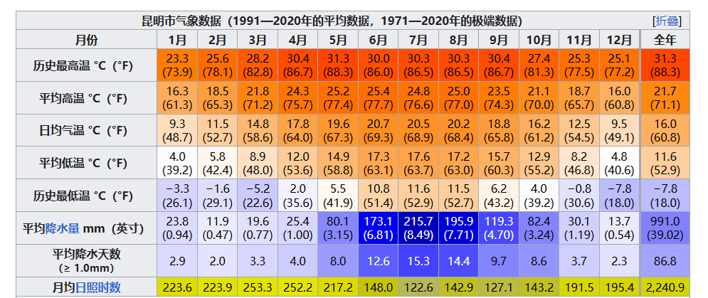
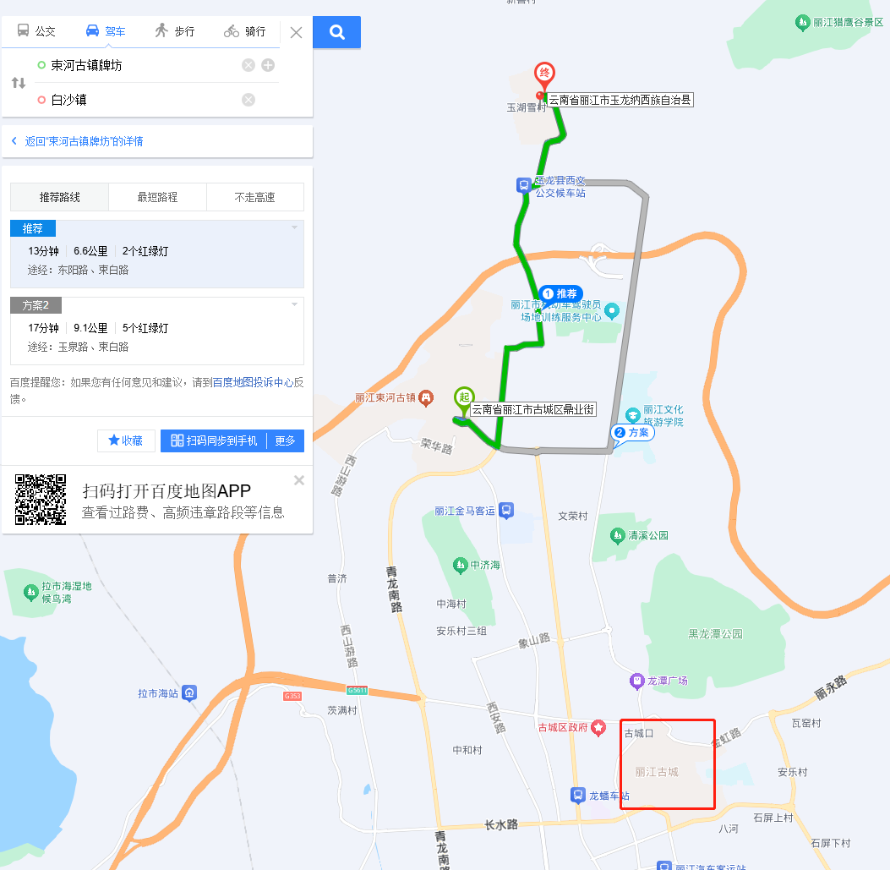
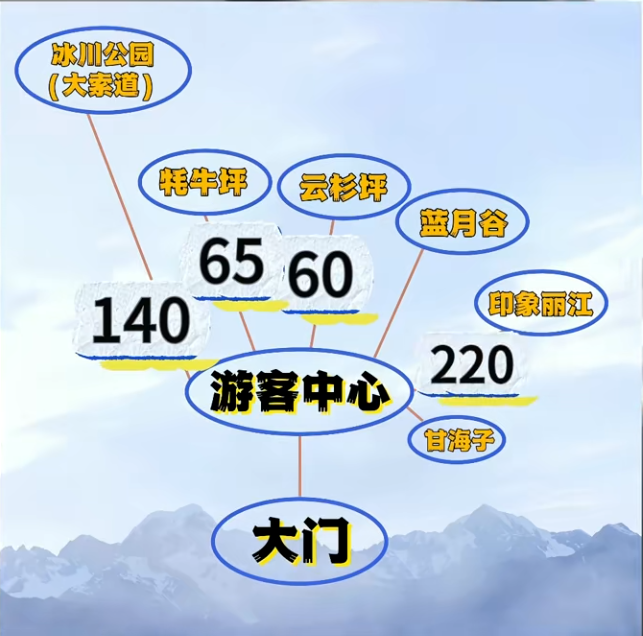
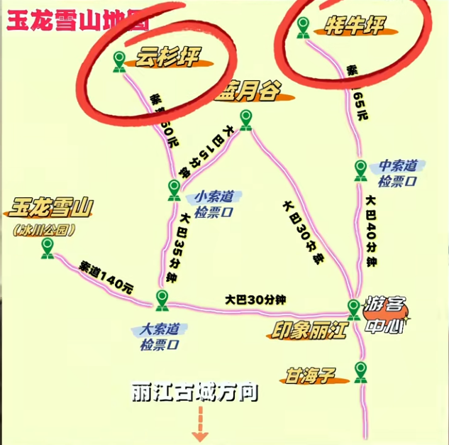
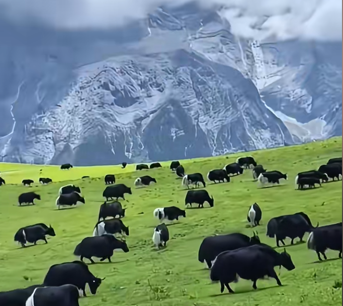
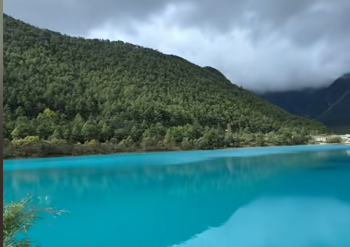
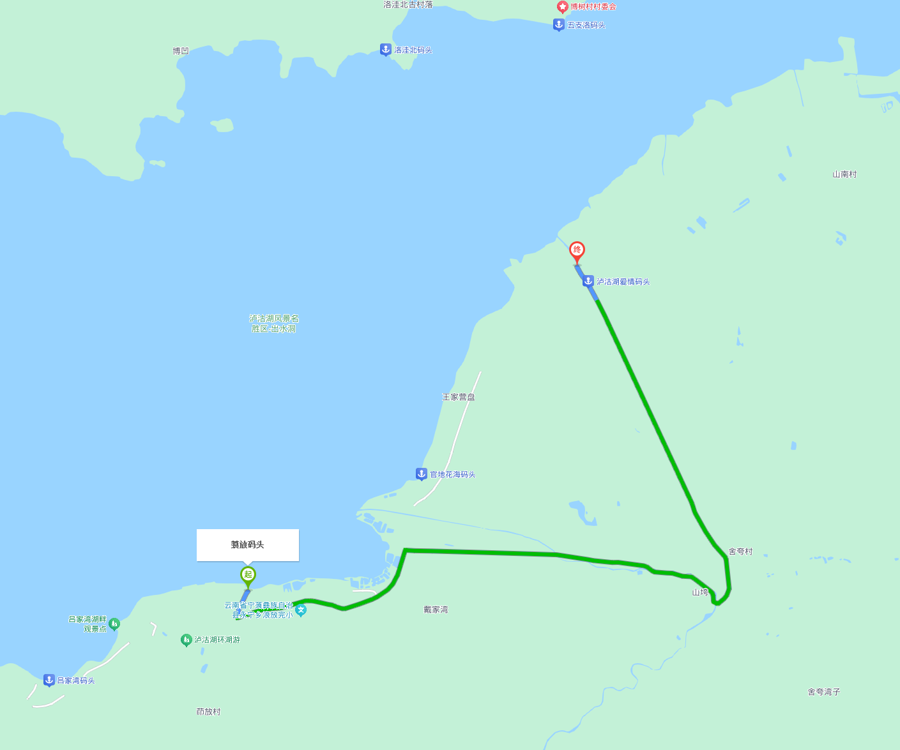
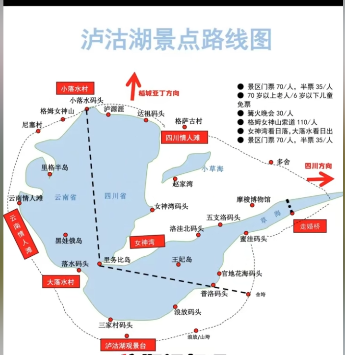
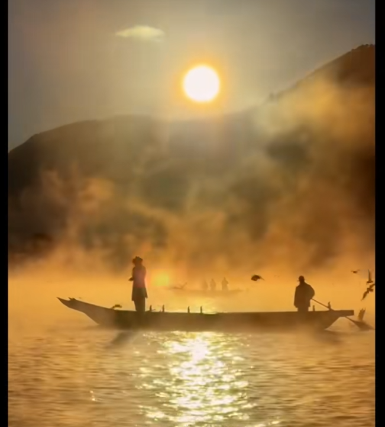
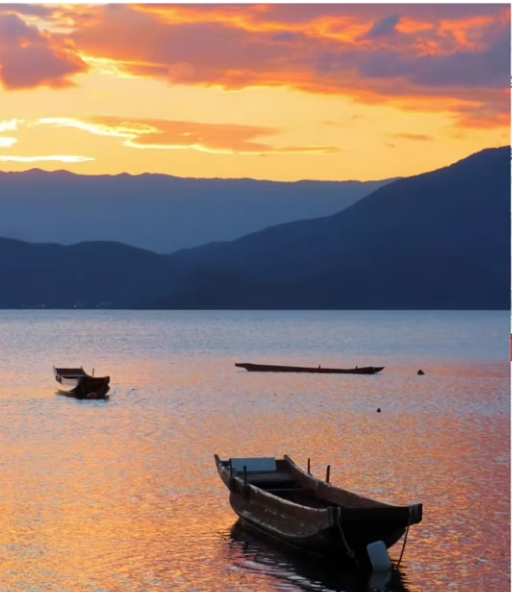

## 简介

雪山有雪才好看。3月份应该是有的。类似苍山。三月初可能还有海鸥。

### 关于交通

从大理到丽江有  高铁。直接坐高铁去就行了。 2个小时就到了。 网约车也很好打车。

### 关于气温

跟云南其他城市差不多。

### 关于住宿

住在丽江古镇 边上外面的民宿(选新一点的，避免老的有的装修破破烂烂)  

### 关于博物馆

无

### 关于游玩

#### Day0

当天看时间，应该是白天上午到，可以选择去白沙古镇和束河古镇溜达溜达。这俩离得不远。然后晚上在丽江古城溜达。

#### Day1 玉龙雪山

##### 路线： 丽江古城有公交车，但是可以直接打车去。

(前提是有雪的情况) 要是没有雪 就不用登顶了。 进山要交100进山费，然后再看你买的是什么票就去对应的方向，就去等对应的大客车，大客车给拉到索道脚下。

> tips: 氧气可以外面买一瓶就够了。药房就有卖的

##### 买票 进山要交100进山费，然后去对应的地方还要交对应的钱。  去丽江旅游集团  这个公众号预约。

(登顶的买大索道票 去冰川公园。4680 )

耗牛坪感觉也还好。（不去云衫坪没意思）

蓝月谷（不要坐电动车，大巴车水月阁下）最好中午时间到  太阳比较旺盛的时候

以上基本在玉龙雪山呆一天。

从玉龙雪山玩完下来之后回丽江古城住的地方就行了。（反正白沙和丽江古城都是顺带着去的，不用特意去）

(如果没买到玉龙雪山的大索道票，就看看找个旅游团，第二天再去)

#### Day2泸沽湖（门票70）

重要的是享受过程，而不是非要到某i个地点，拍什么东西。

这个一般是从丽江上午出发，中午才能到 路程大概是4个小时，丽江过去有大巴车（丽江交运），也有那种包车的（包车可以联系民宿老板问问）丽江古城北门或南门直接到大落水客运站

到泸沽湖后是需要包车的。（**顺时针环湖**）

第一天到了可以包车环湖，拼船一个人大概150不到 包船 250   包车300左右

住蒗放村那边。可以方便去看晨雾。（也有湖景房）

##### 景点

最关键的是晨雾和日落。晨雾早上比较冷要多穿点，靠近草海的晨雾才最好。（爱情码头看晨雾）7.15之前到码头

情人滩  云南情人滩和四川情人滩区别不是很大，去哪个都能看泸沽湖的全景。里格半岛那块也有观景台

篝火晚会可以不去，感觉没意思、

猪槽船如果不是 7-9月份看水性杨花可以不用坐，就是水里划船。（看晨雾可以坐）

女神湾是日落最佳观赏点。

