## 简介

主要是一些自然景观。环洱海，分为海东和海西。先去海西、 （偷张图）   日出去海西，日落去海东。 **建议二月末，三月初去**（苍山4月份也有雪）

#### **一定要做好防晒**

海西玩的比较多，海东没啥玩的，可以在双廊住个一线海景房，感受一下。看看日落发发呆也挺好。

### 关于交通

有火车站和机场。没有地铁，景区之间也比较远，感觉自驾效率比较高。海西的生态廊道是不让车进的，外面的电动车都不行，所以可以第一天去海西生态廊道玩，第二天去能开车的其他地方。

### 关于气温

气温常年都是零度以上了，看降雨量可以推断出 6，7，8月份·可能会天天下雨不适合待着了。风比较大。带点冲锋衣。

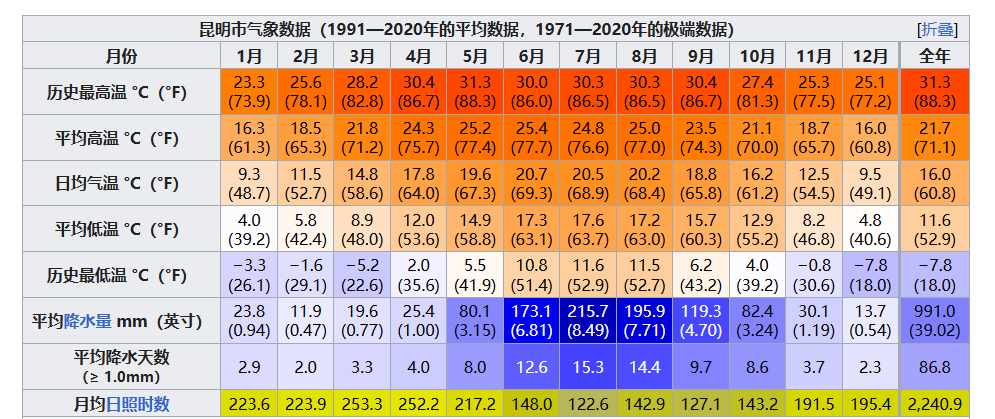

### 关于住宿

当天住大理古城附近，早上去看日出。

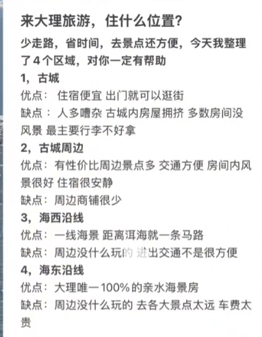

### 关于博物馆

NO

### 关于游玩

#### Day1

大理古城附近住，第一站去龙龛古渡看日出、

##### 日出： 心邸咖啡、龙龛古渡(人多)、才村码头(定位大理屿月设计师民宿)  这三个选哪个都行

下面是龙龛古渡 （上午海面蓝色的还挺好看）

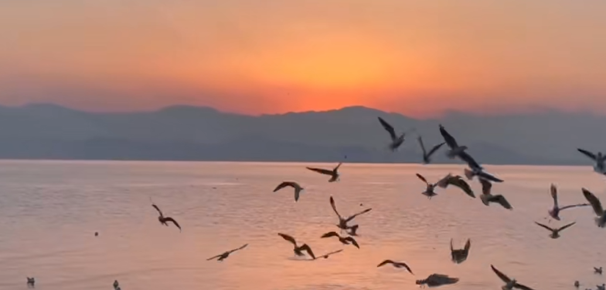

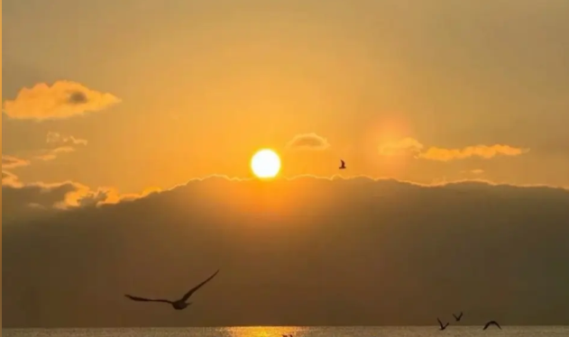

下面这个是心邸咖啡

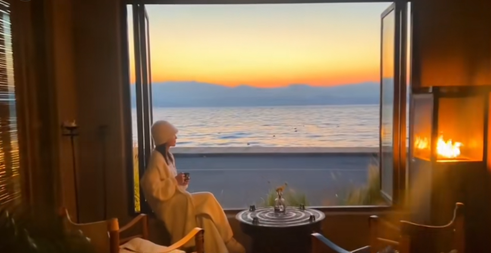

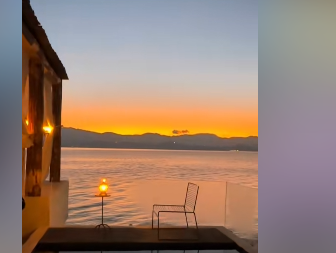

下面是才村码头

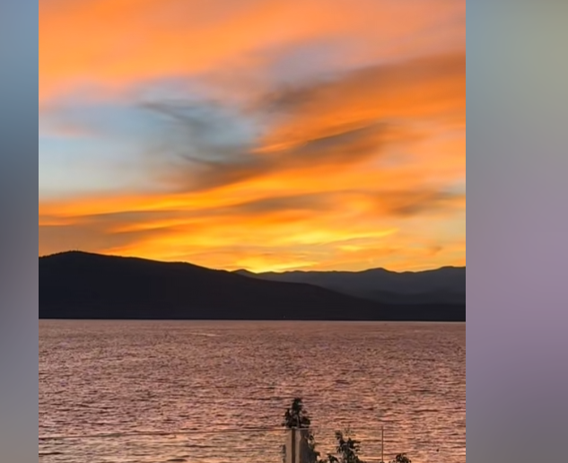

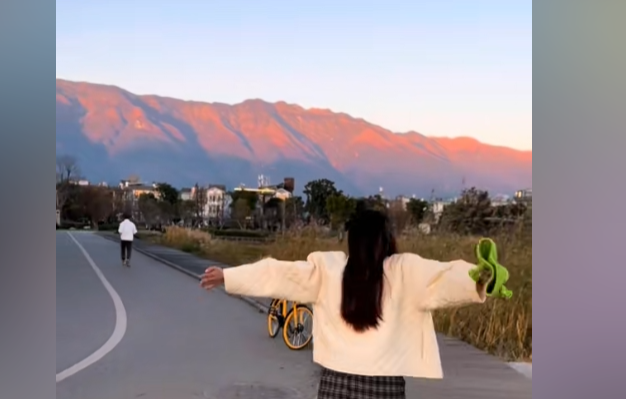

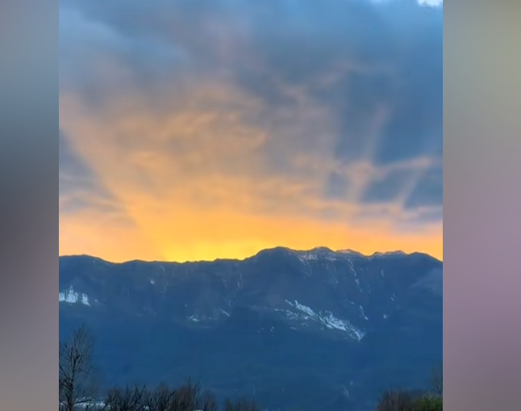

看完日出之后，沿着海西往上走。

##### 租个景区的电动车：在景区内租，车速比较慢   20km/h  （看好有电在开锁）

龙龛码头(0km)------才村(3km)-----潘溪S湾(13km)-----廊桥(20km)------海舌公园(26km)  海舌公园看情况可以不去，从廊桥直接去喜洲古镇

路上就是随时骑随时停，想拍啥就停下来拍。

##### 喜洲古镇

喜洲古镇   34月油菜花，9中-10月底风吹稻浪。景区内没啥东西，有个小火车和风吹麦田还有点意思。  估计顶多2个小时就完事了。

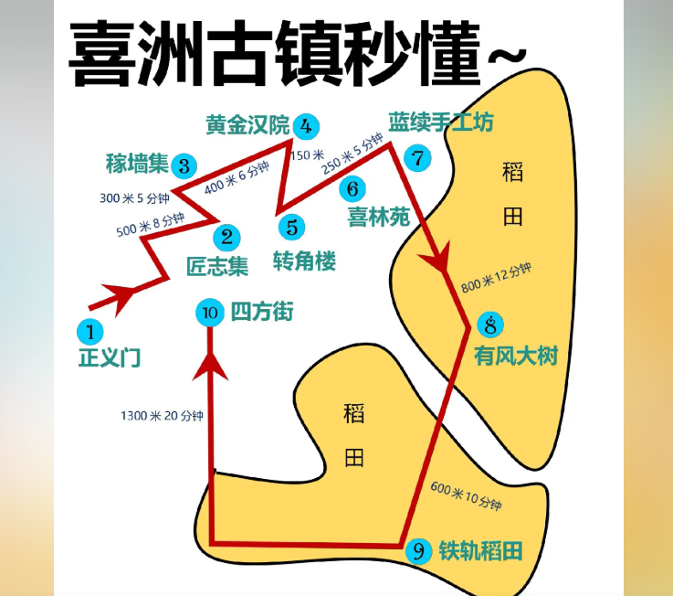

**苍洱大道（到人民法庭）**有个打卡点(流浪摄影师) 这块有很多摄影师拍照 15一张拍完选完给钱这种（下午3-6点拍）

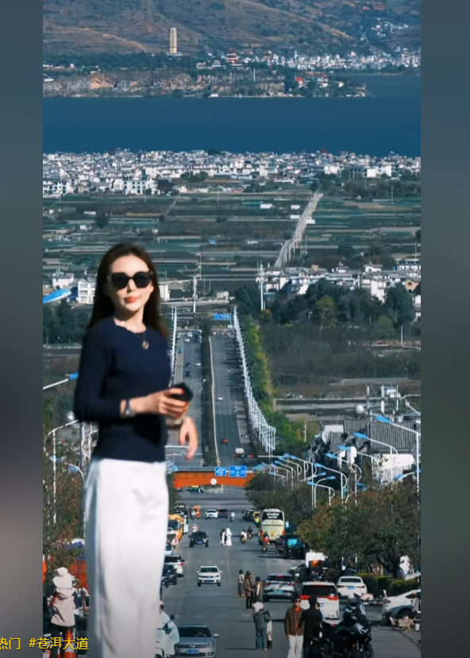

然后找个地方吃个晚饭休息一会。

##### 大理古城

晚上在大理古城溜达溜达。大理古城大元帅府对面广场8-9点有篝火晚会

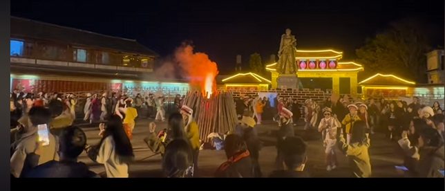

##### 者摩山（得有无人机 旱地拔葱） 7-12月能到山顶 （山顶的观景台  云际一号 拍的比较多）4点能到在考虑去 呆的久可以考虑去

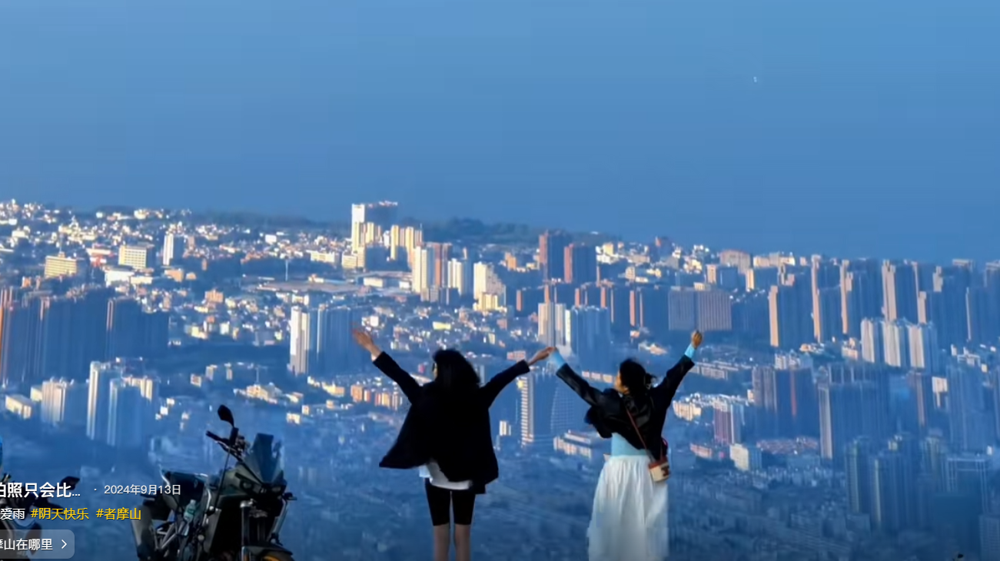

#### Day2

##### 上午：苍山（洗马潭索道。可以登顶）晴天再去！！！阴天不好看

从大理古城打车到苍山景区，进景区之后有摆渡车给拉到索道口。洗马潭索道可以网上购票 （洗马潭在七龙女滩索道处会换乘一次。）

早点去 9点之前到。**上行时间：08：30——14：00，下行时间：08：30——17：00**

#### Day3 

海东逛一圈

有两种方式。一种是租车自驾  一种是坐环洱海大巴，优先自驾(如果自己去可以考虑大巴)  慢慢溜达

海东看个日落。 在挖色镇，鹿卧山这块   其他地方没啥想去的

 

