## 简介

可以作为云南省的第一站，大约二月末到。

昼夜温差比较大，带点厚衣服。

### 关于交通

有机场、有火车站，也有地铁（目前有5条地铁线路）。

地铁可以直接刷支付宝（公交也可以直接刷支付宝）。

#### 出发：

以目前北京到昆明为例，直飞4个小时还挺快的，**从机场到市区可以做地铁**。下图是2024年11月16日查飞猪机票的价格。

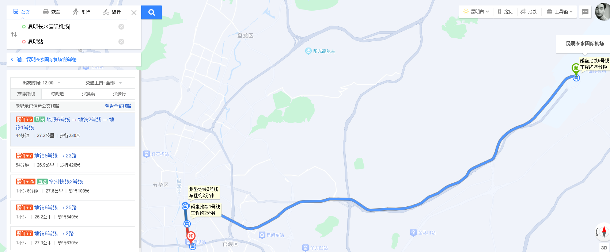

### 关于气温

气温常年都是零度以上了，看降雨量可以推断出 6，7，8月份·可能会天天下雨不适合待着了。

### 关于住宿

住在市区里，因为这几天玩的方向南边偏多，如果带的行李不多的话就一天换一个地方(预计不是旺季，酒店并不贵)，如果有行李箱之类的，那就住市区里。五华区偏南的位置。

### 关于博物馆（注意大部分博物馆周一闭馆）

有云南省博物馆、昆明博物馆、云南民族博物馆。 三个博物馆在三个方向，可以根据在哪边玩路过。

云南民族博物馆在云南民族村那边。

云南省博物馆在偏南的位置

昆明博物馆在昆明站北部，属于市区的位置。

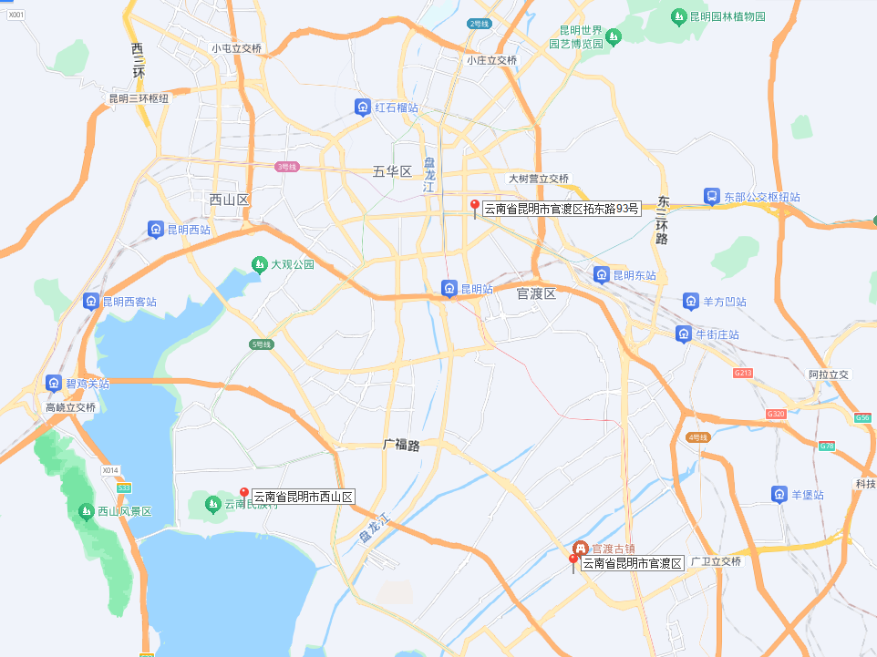

### 关于游玩

#### Day1 （第一天去的基本都是市区，甚至可以省略）

第一天行程可市区溜达。从上往下来，第一站去圆通山（3月有樱花），估计1~2个小时吧，然后去园西路吃点东西，从云南大学南门穿过去，路过去文化巷&文林街那边，然后去讲武堂，翠湖，从翠湖南门出来，路过黄公东街，走到对月楼，路过东方书店进去瞅瞅，昆明老街，然后去傲城大厦拍那个照片，然后基本已经晚上了，去南屏街步行街溜达买小吃，然后去南强街溜达买小吃 这块是夜市。

上面这些地方   那个傲城大厦拍照感觉有点欲望，其他都一般，时间充足就去。可以根据几点到云南来判断。

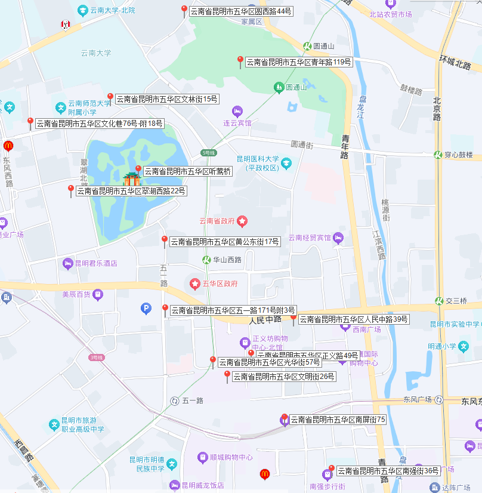

**上午**

 **圆通寺**（不一定去寺庙，附近看看樱花） 。昆明樱花开放时间为3月上旬到4月上旬。如果11月去，那就不去这个地方了。直接去云大看银杏叶，然后园西路继续。

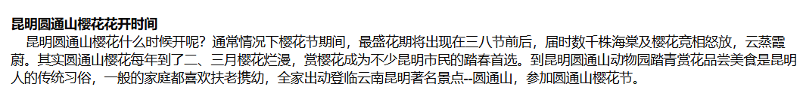

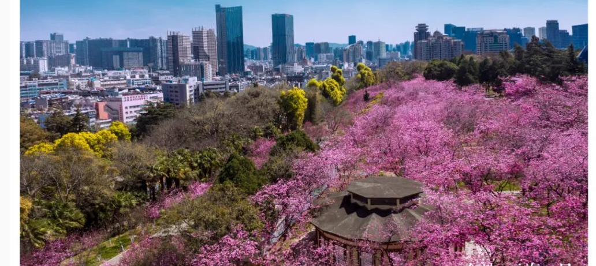

去云南大学右侧的 **园西路** 吃饭，是一个小吃街，（文化巷也有一些吃的）然后从云大穿过去。

**云南大学**（秋季去的话有个银杏大道，春天应该都是绿叶）

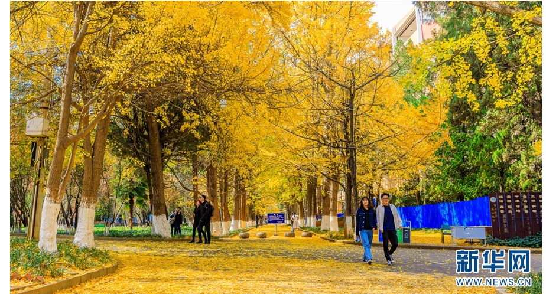

从南门出来，路过那个 **橡皮书店** 然后去左侧西边的 **文化巷** **文林路 **拍拍照  

然后去**讲武堂** 是滇军的开头。民国史，路过过去瞅瞅。（黄埔军校在广东）

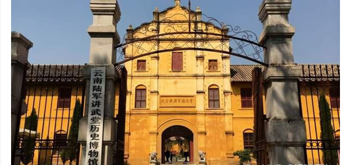

 

**下午** 翠湖公园南门出来之后开始 on foot  这个顺序路线  **黄公东街**   **非正常咖啡馆  傲城大厦  昆明老街  对月楼**   

咖啡厅如果累了还有空位可以休息一下。没有就当路过（这几个地方都是没啥意思的，到时候看情况愿意走就去溜达溜达）

**傲城大厦**  这个视角还是挺帅的

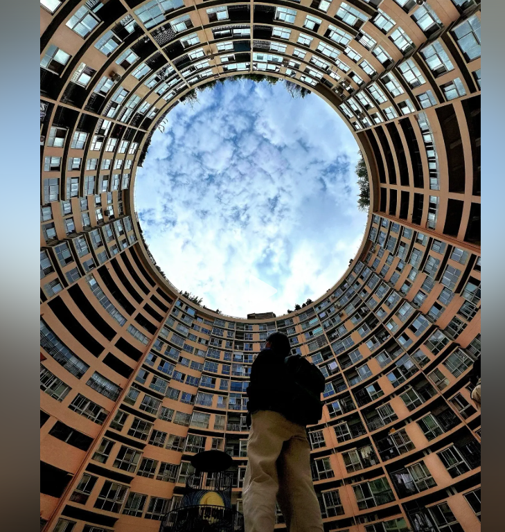

**晚上**去 **南屏街**（步行街，在东风广场地铁站周边） 去周边吃点东西啥的。周边有个南墙街巷夜市

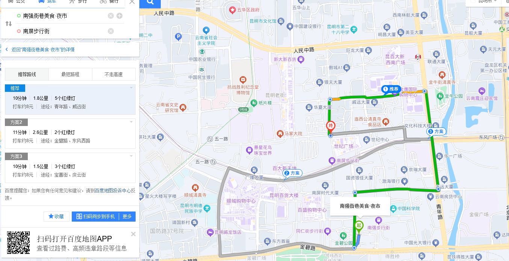

#### Day2

这天去的地方虽然都在南边，但是隔得很远。 先去篆新菜市场 （吃个早午饭） 然后去 云南博物馆 (官渡古镇，这个古镇随便逛逛路过)。然后去斗南花市。然后去捞鱼河湿地公园(公园要早点到，5点关门，说不定4.30就不让进了)

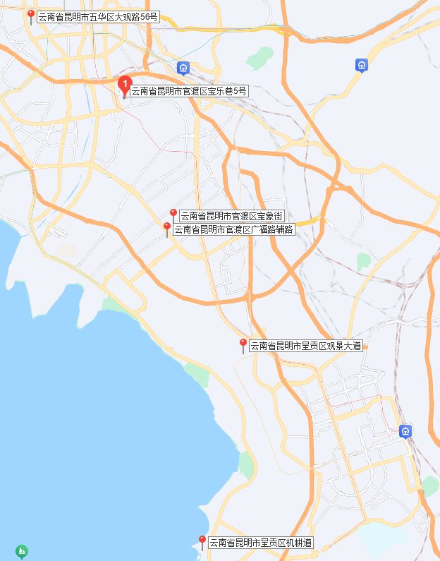

**上午 篆新菜市场**  看看当地都有啥新奇的菜和水果。（属于那种长天开的，不是早市）

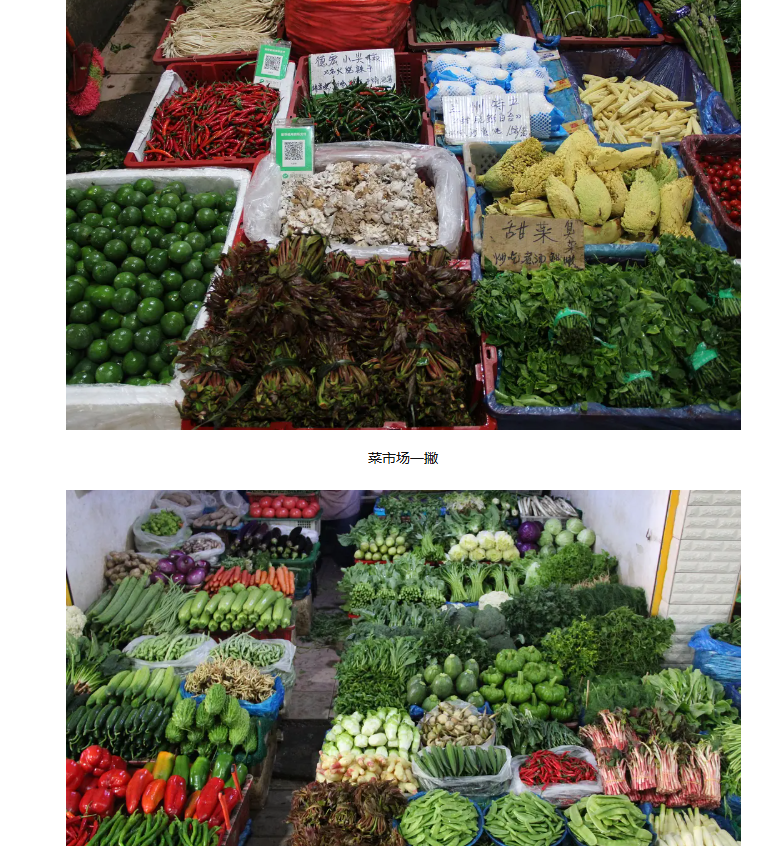

##### 南部郊区

**中午** **云南省博物馆**。预计2个小时左右  到中午了去官渡古镇附近乱吃。（商业化的一个地方，或者周边随便吃点啥也行，古镇没必要去）

**下午** 去**斗南花卉市场**（这个花卉市场比较有名，虽然没那么喜欢花，但是据说是全国最大的花卉交易市场）

一天去完这几个地方基本就没啥查克拉了，第三站的花卉市场可以直接打车去。

然后去两个公园二选一 **捞鱼河湿地公园** （最好4点能到这里，在这看个日落可以，根据当天天气情况。6点日落）

~~海洪湿地公园（北门）下午(4.30)去(5.30有人喂海鸥比较多)，中午没有海鸥~~

**晚上吃饭**  如果去的捞鱼河可以去呈贡区的市区吃，吃完看看坐高 铁回昆明老市区。

