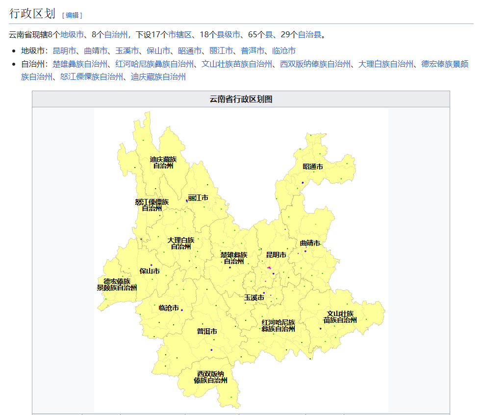
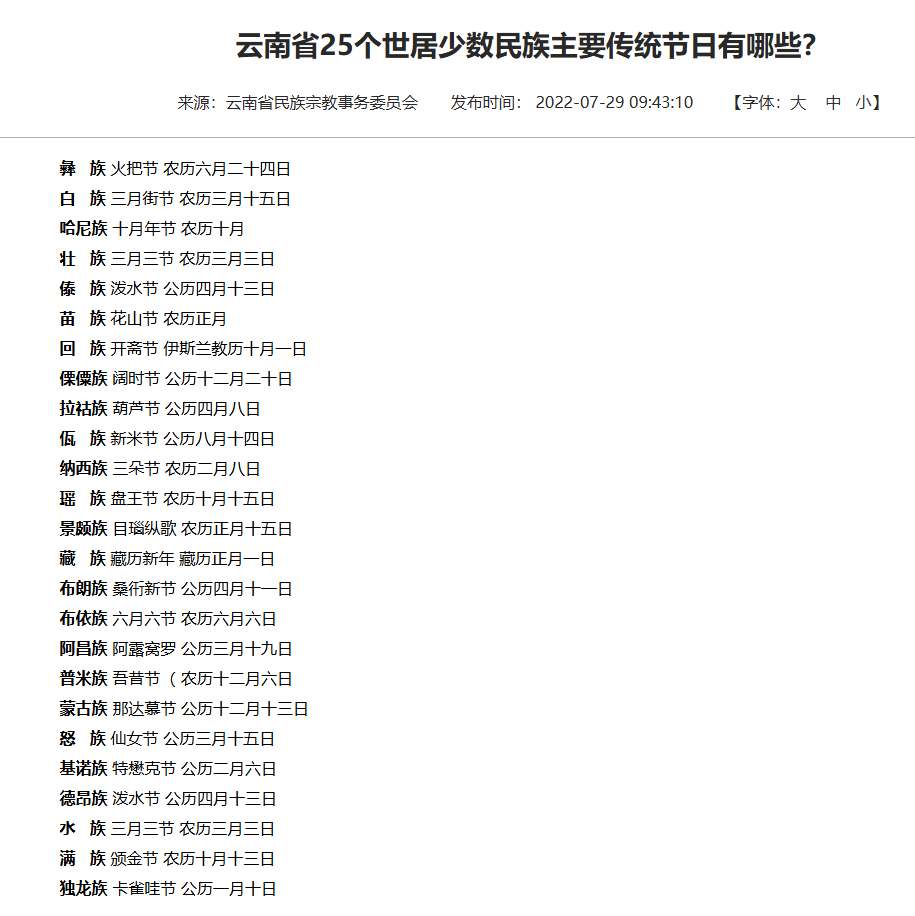
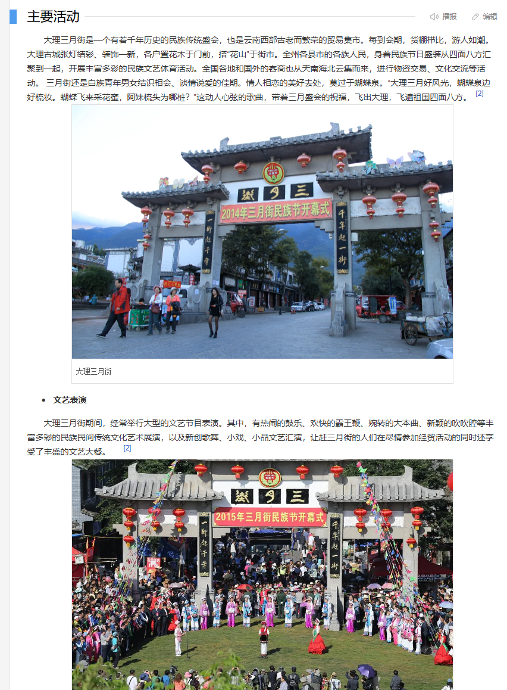
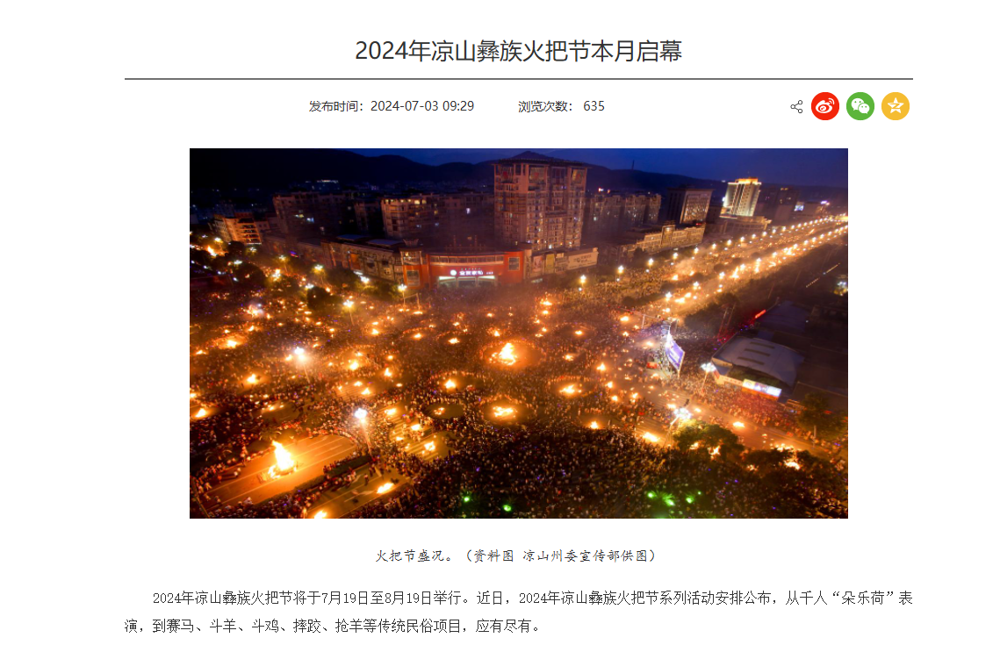
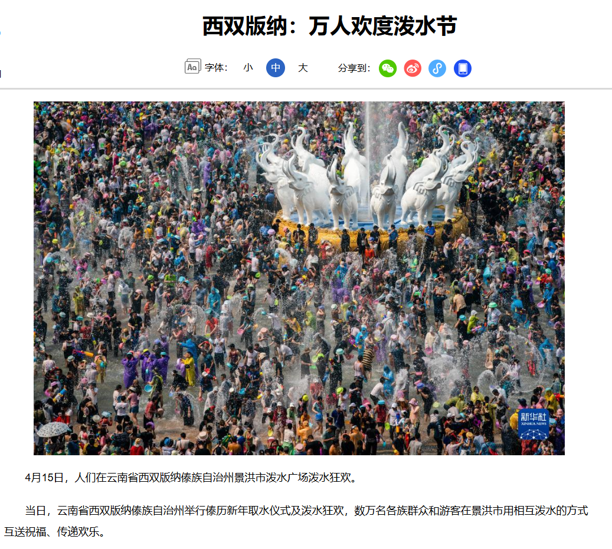
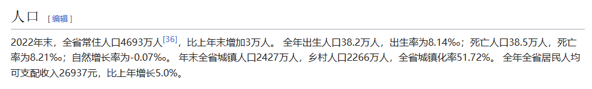
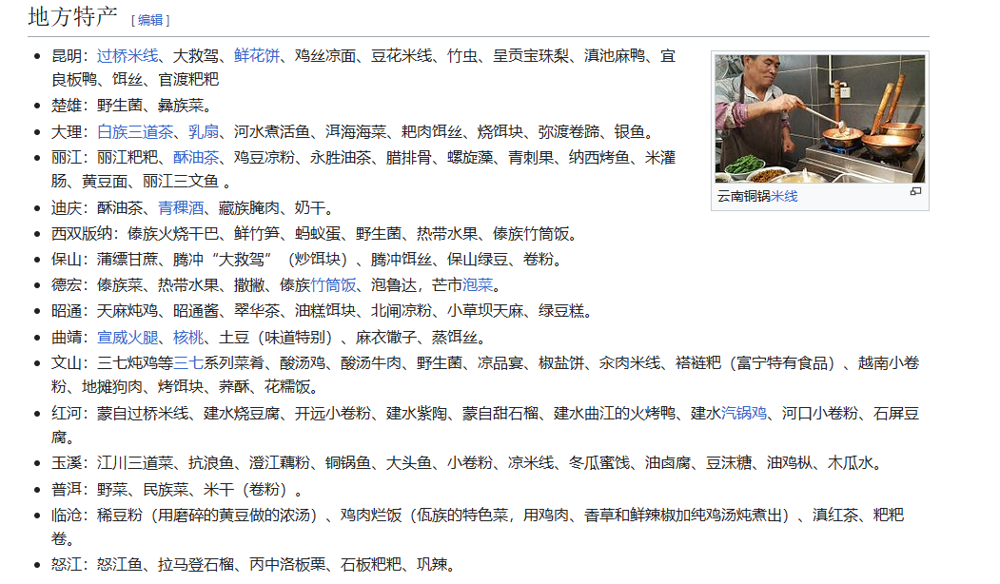

## 关于云南省

### 最适宜去的月份

2月末。二月末   有一些植物已经生长起来了，大理的喜洲有油菜花了。海鸥也还有一部分，海鸥大概是三月初开始飞走。而且2月3月这个时间节点的话，雪山一般都会有雪的，大夏天雪山有可能没有雪全是大石头。综合所有云南的景点这个时间节点去都可以。泸沽湖这个时间节点还会有晨雾。

**云南一年四季赏花月历**

　　**一月**

　　梅花：大理洱源松鹤村

　　**二月**

　　油菜花：罗平油菜花田

　　马缨花：昆明嵩明马鞍山

　　郁金香：昆明捞鱼河公园、翠湖公园

　　玉兰花：昆明西山玉兰园

　　**三月**

　　樱花：大理大理大学、昆明圆通山、宜良樱花谷

　　海常花：昆明圆通山

　　桃花：怒江丙中洛桃花岛、文山普者黑景区

　　**四月**

　　杜鹃花：昆明轿子雪山

　　**五月**

　　鸢尾花：腾冲北海湿地

　　蓝花楹：昆明教场中路

　　**六月**

　　杜鹃花：香格里拉碧沽天池

　　薰衣草：弥勒东风农场

　　**七月**

　　向日葵：昆明螳蝍川向日葵花海

　　荷花：文山普者黑、昆明大观公园

　　**九月**

　　菊 花：沾益大坡乡、玉溪磨盘山

　　**十月**

　　波斯菊：丽江玉龙雪山东巴谷、昆明石林乃古石林景区

　　**十二月**

　　樱花：大理无量山樱花谷、昆明红塔西路

### 简介

云南省是我国少数民族最多的省，云南的少数民族有很多传统节日。 历史上225年，诸葛亮七擒孟获就是在这，当时这个地区叫南中。这个省份，植物种类也特别多。

#### 地理位置划分

#### 云南省是我国少数民族最多的省

#### 云南的少数民族有很多传统节日。

最有名的是这三个

- [白族](https://zh.wikipedia.org/wiki/白族)[三月街](https://zh.wikipedia.org/w/index.php?title=三月街&action=edit&redlink=1)     市集还有一些活动  2024年大理“三月街”民族节将于4月23日至4月29日（农历三月十五日至二十一日）在大理市举办
- [彝族](https://zh.wikipedia.org/wiki/彝族)[火把节](https://zh.wikipedia.org/wiki/火把节)     2024年凉山彝族火把节将于7月19日至8月19日举行
- [傣族](https://zh.wikipedia.org/wiki/傣族)[泼水节](https://zh.wikipedia.org/wiki/泼水节)     《西双版纳州人民政府办公室关于2024年部分节假日安排的通知》2024年泼水节4月15日至17日放假。

#### 人口

人口增长率也是负的。

#### 特色小吃

