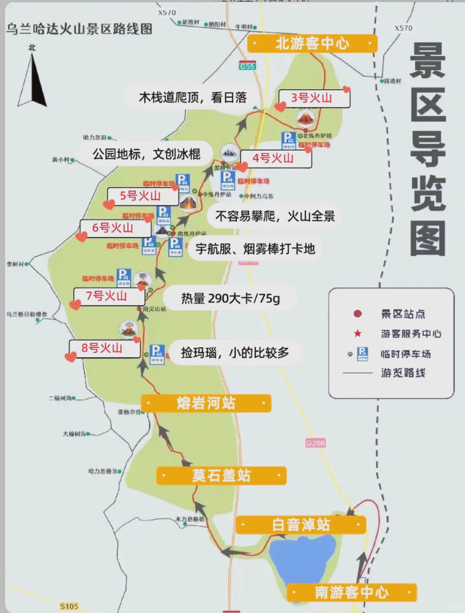

## 简介

### 关于交通

1. 各个景点离得很远，哈达火山周围有一个火车站。黄花沟40KM外有一个火车站 

   1. 集宁南站(乌兰察布市内的一个车站)---白音察干站(到哈达火山南区4KM) 11.30~12.47 有一趟车。
      1. 打车到哈达火山南区游客中心（玩5h足够了）
   2. 返回市区：原路车站(火山得从南区出来) 白音察干 ~ 集宁南  18.27 ~ 19.26 有一趟。

2. ~~〖高铁〗乌兰察布站 ~ 卓资东站 D1203  08:35-09:23  卓资县距离辉腾锡勒草原仅35㎞。（票可能不好买）还有一趟10.16 集宁南 ~ 卓资东站  10.48的~~

   1. ~~打车到黄花沟景区北游客中心（玩4h足够了）~~
   2. ~~返程，可以回到 卓资东站  然后坐高铁直达北京。有一趟 19.10 ~ 21.19的。也可以选择提前回乌兰察布市区~~

   

### 关于气温

昼夜有温差，预计8月份去

### 关于住宿

住乌兰察布市区一宿

### 关于博物馆

乌兰察布博物馆

### 关于游玩

#### Day1

乌兰哈达火山。目前的计划是坐火车去。优先去 6，5，3  时间够4也去。不够就不去了。 

#### Day2（不去草原了）

~~黄花沟买景区门票，不买套票，然后买一个3号索道的索道票即可。90门票 + 50索道票，都是当场买就行。~~

1. ~~从北门进去之后，到3号索道直接步行。溜达拍照。~~
2. ~~3号索道下去之后有小火车和滑草。景色好一些。下索道不要直接坐小火车，小火车的终点是南门游客中心。~~

