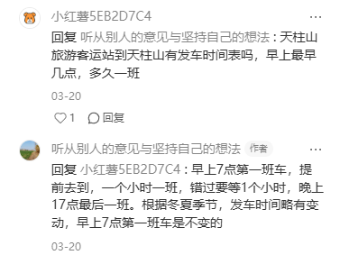
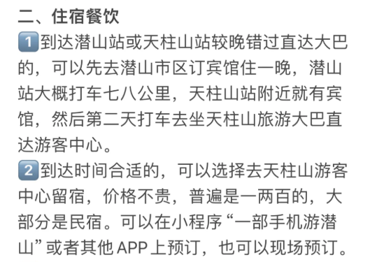

## 简介

### 关于交通

北京到安庆有两趟车直达，一趟高铁，一趟K。

1. 如果抢到高铁，就在潜山站下。打车到市区(10km左右)。
   1. 北京直达潜山的，没有合肥中转的快
   2. 北京到武汉来个一日游---第二天武汉到潜山 7.53~9.33 《预计走这个线》
2. 如果是K，就在天柱山站下

坐车到天柱山：天柱山旅游客运站这个位置有大巴（7点最早）。或者打车。大概30分钟路程

### 关于气温

20+ 预计10月初去

### 关于住宿

市区（财富广场周边）

### 关于博物馆

无

### 关于游玩

#### Day0

北京出发，做一天车，到地方休息

#### Day1

走徒步登山路线。