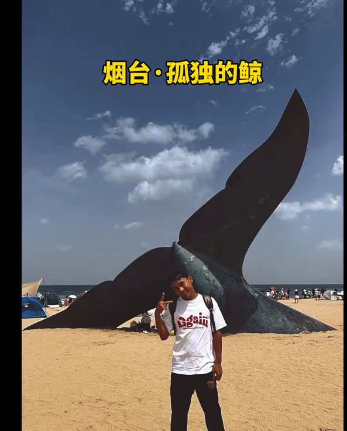
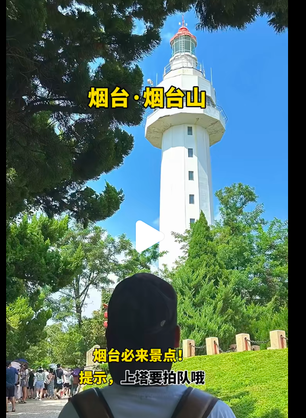
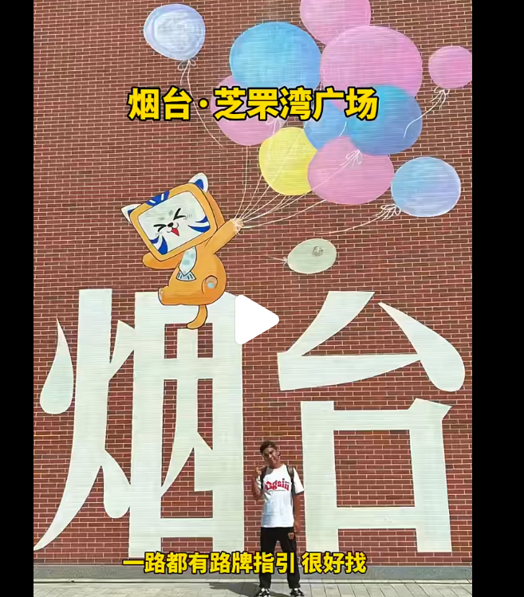
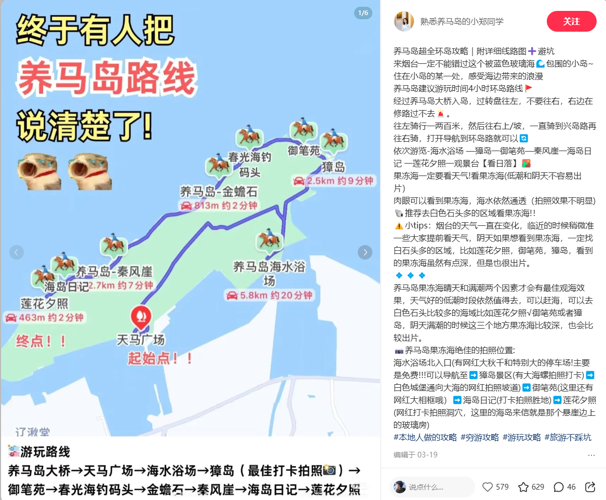
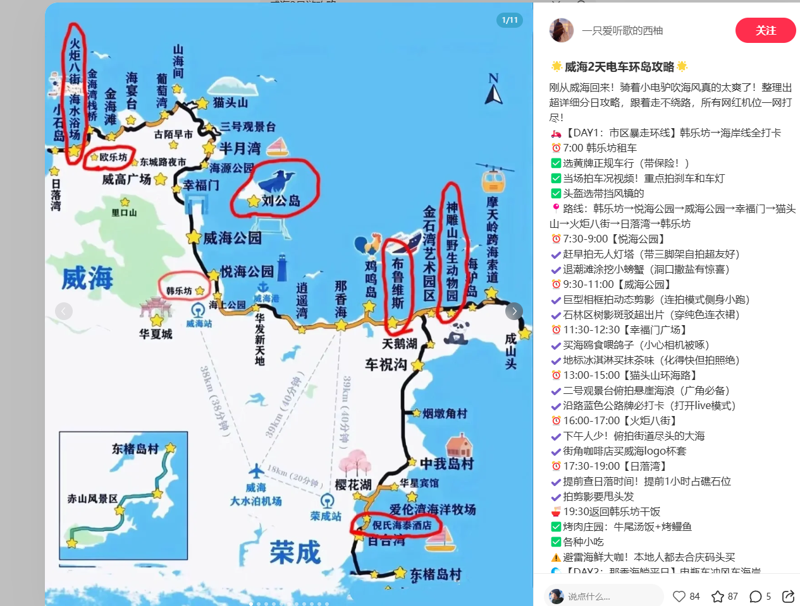
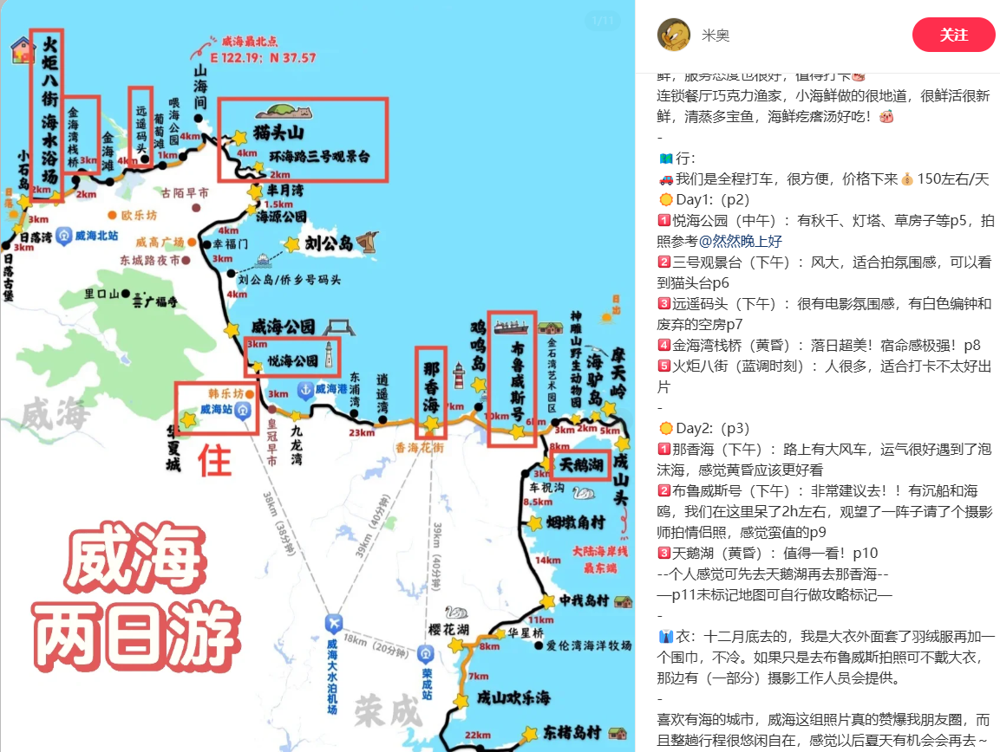
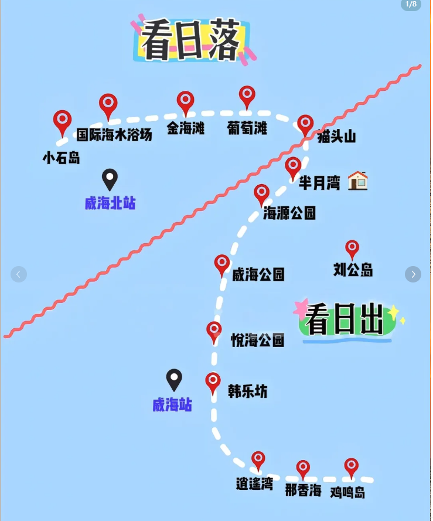
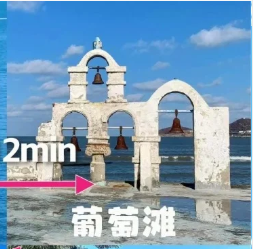
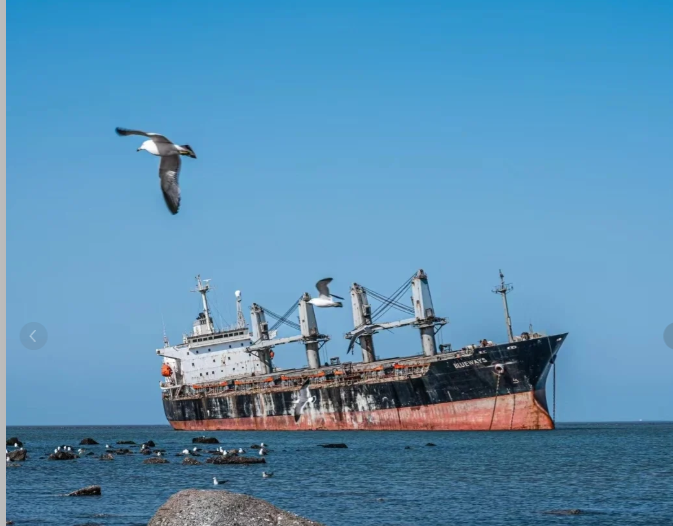
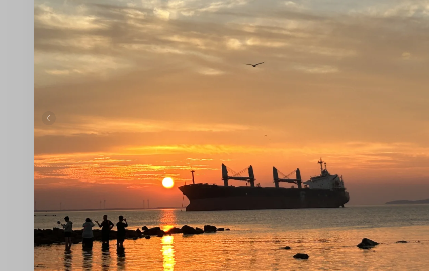

## 简介

主要是海边

### 关于交通

没有地铁，打车

### 关于气温

### 关于住宿

威海 住在 威海站周边。

### 关于博物馆

无

### 关于游玩

### 烟台

1. 孤独的鲸

2. 烟台山

3. 朝阳街（烟台芝罘湾广场）所城里

4. （东炮台-可省略）

5. 鱼人码头

6. 滨海中路

7. 烟大小吃街

   

鱼人码头（千与千寻铁轨）

5.3上午去养马岛，下午去布鲁斯号。

### 威海

#### 威海准备去的景点

5.4日路线，可以半月湾或者

##### 威海站以北：

1. 悦海公园
   1. 有一堆小船

2. 半月湾（日出）
3. 三号观景台
4. 猫头岛（环岛）
5. 葡萄湾
   1. 

6. 金海滩
7. 国际海水浴场（日落）

##### 威海站以南

1. 布鲁斯沉船（蓝调时刻） 可以选择，前一天下午过来。

   

以上要是一天时间够的话，可以从上往下玩

