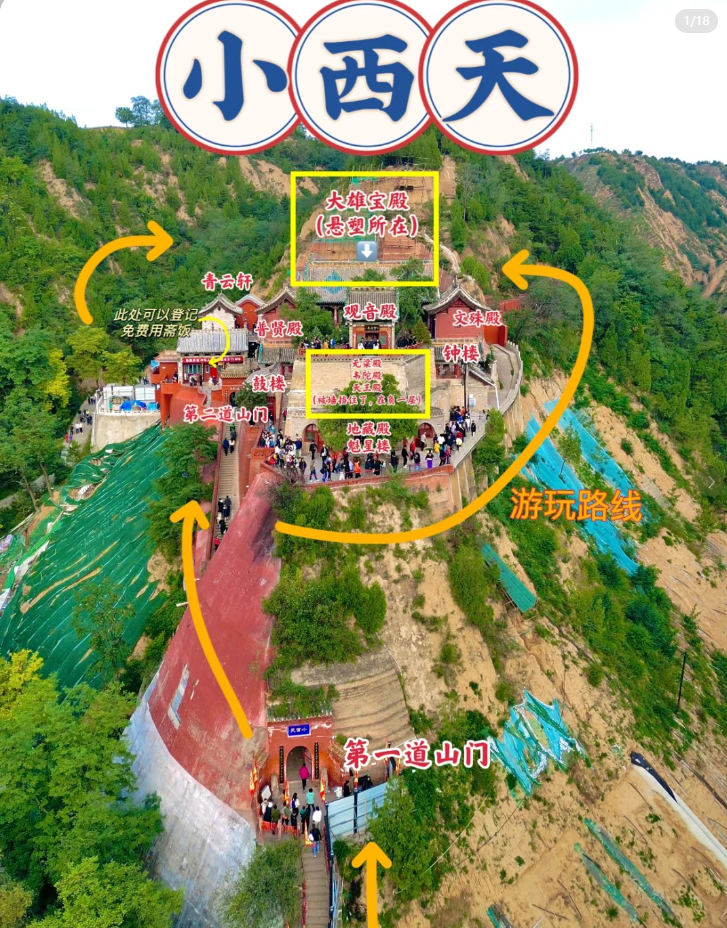

## 简介

主要想去的 壶口瀑布，小西天，这俩，广胜寺看情况。

### 关于交通

交通不太方便，景区离得犄角之势，包车前往！！！

### 关于气温

4月份去的  10多°

### 关于住宿

住在鼓楼那边了（酒店便宜哈哈哈哈哈）

### 关于博物馆

临汾博物馆

### 关于游玩

#### Day1

上午坐高铁到临汾。15.12到，先去博物馆（16点截止入园，得抓紧时间）。博物馆逛完了，去酒店休息一下，附近吃个饭。

#### Day2

包车一日游，壶口瀑布，小西天，广胜寺

##### 壶口瀑布

需要买小交通的票和门票，坐小交通到下车点，往前走就到了。 景点大差不差。

##### 小西天

从前面进去，顺时针转就行了

##### 广胜寺

广胜寺分为上寺、下寺两部分，把光线充足的时间段留给下寺看水神庙壁画，整体游览时间约2-3h

几个机位：

