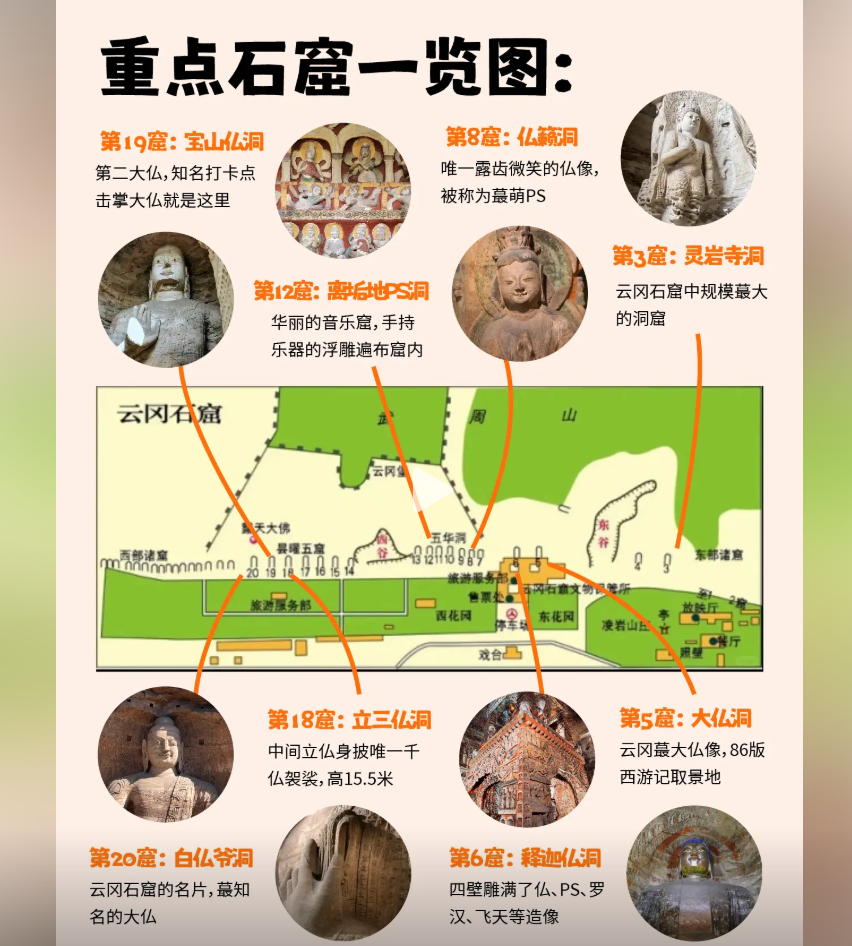

## 简介

### 关于交通

没有地铁，滴滴or 公交

### 关于气温

跟北京差不多

### 关于住宿

住大同南站附近看看周边

### 关于博物馆

有个大同博物馆，国家一级，可以看情况考虑去不去。

### 关于游玩

#### Day1恒山&悬空寺（早点去，晚去人多排队）

**从大同市里可以坐901-1路去浑源县**，坐到**集散中心**站，然后坐景区摆渡车去悬空寺，悬空寺可能排队人多（登临）悬空寺和恒山景区之间以及游客中心之间的摆渡车票可以一直用。  

> tips 车坐右边座位

参观完悬空寺之后，坐摆渡车到恒山岳门湾，恒山坐摆渡车到恒宗停车场，然后再步行上山（摆渡车20元可以在这几个地方自由动，包括恒宗）

- 登临悬空寺，需要提前预约，恒山景区公众号，悬空寺和恒山和登临票都能买。提前7天放票。
- 

如下图，现在得去买景区摆渡车票才能进去，所以得提前下车。

#### 关于恒山到应县木塔

浑源汽车站有车，下午13.20  14：20，15：30有车。一个小时到。到时候可以看情况去不去。2点的车能赶上就可以考虑去。恒山游客中心也有拼车过去的。

5.30之后应该就进不去了。6点开放截止。

- 应县有高铁到大同。18.38，18.54 有车。
- 应县汽车站也有车到大同，20分钟一趟大概。6点末班车   一个小时左右
- 纯木结构

#### day2  云岗石窟   大同古城 (大同博物馆)

##### 云岗石窟

公交都能到，到时候根据酒店位置 看坐公交还是打车。没必要买观光车票。云岗智旅公众号可预约买门票

- 预计呆3个小时。一上午 （8.30开门）

一进门新修的石头柱子和寺庙都没必要看。顺着走就行了，直奔石窟。

- 
- 第五窟
- 
- 第七窟和第八窟是最早的，看看顶部的画
- 第十三窟
- 
- 
- 

中午左右去大同古城附近  随便吃点  5点大同古城里面的各个寺就关了，所以还是得提前过去。

- 大同博物馆4.30停止入场

路线推荐：

