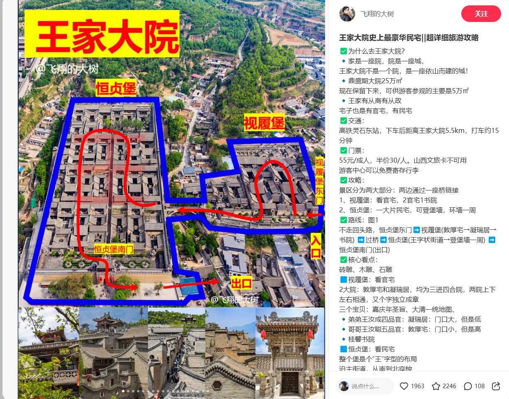
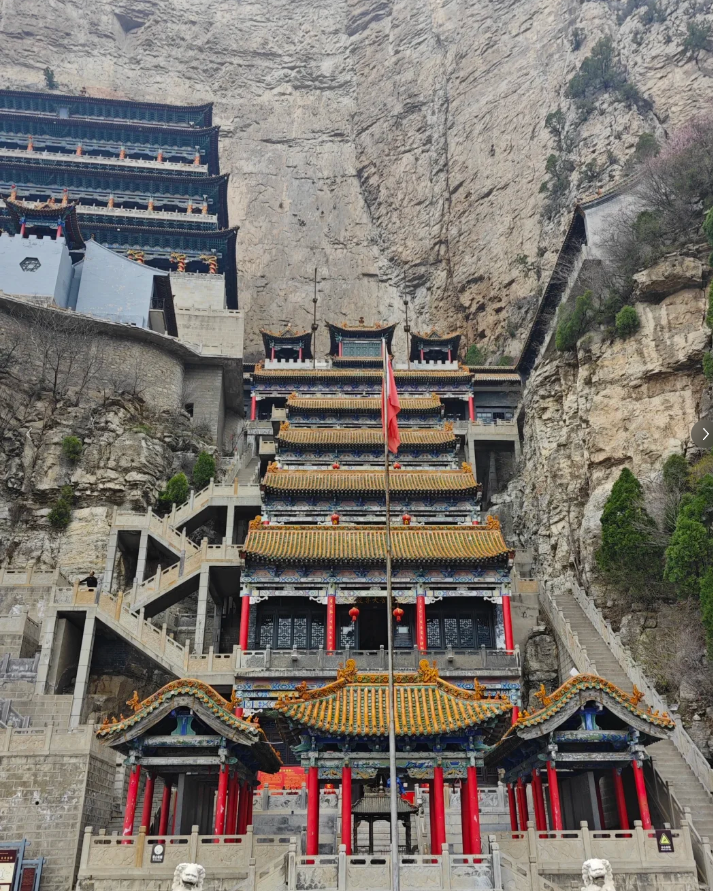
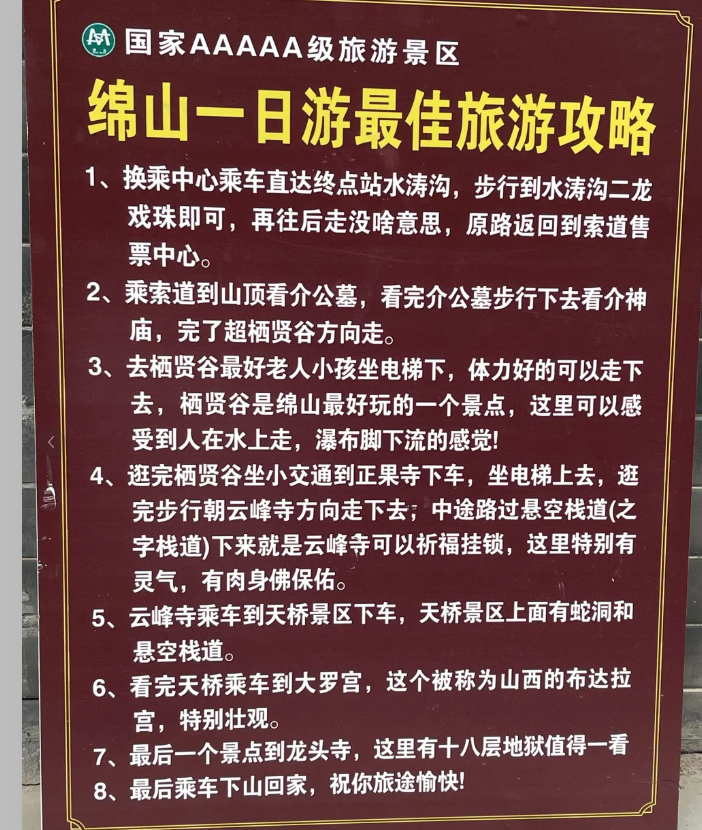
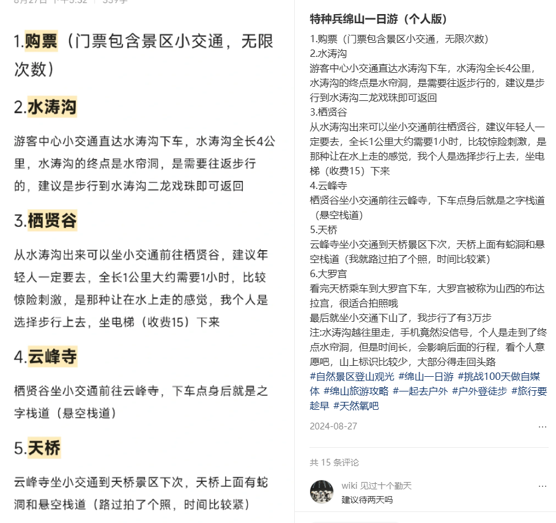
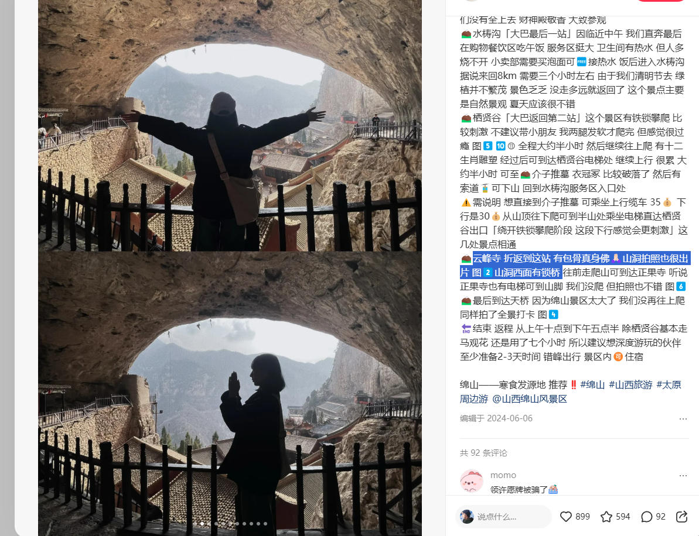
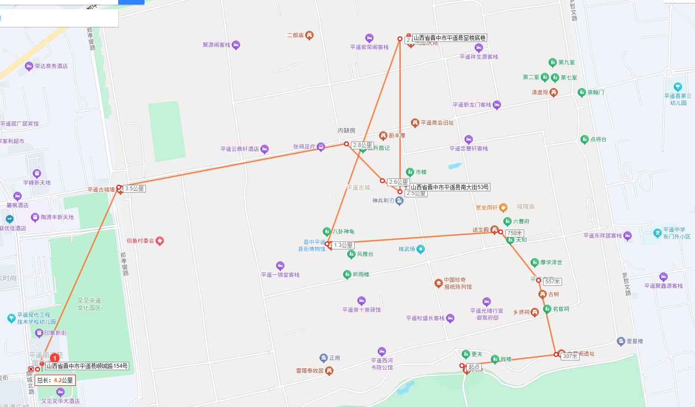
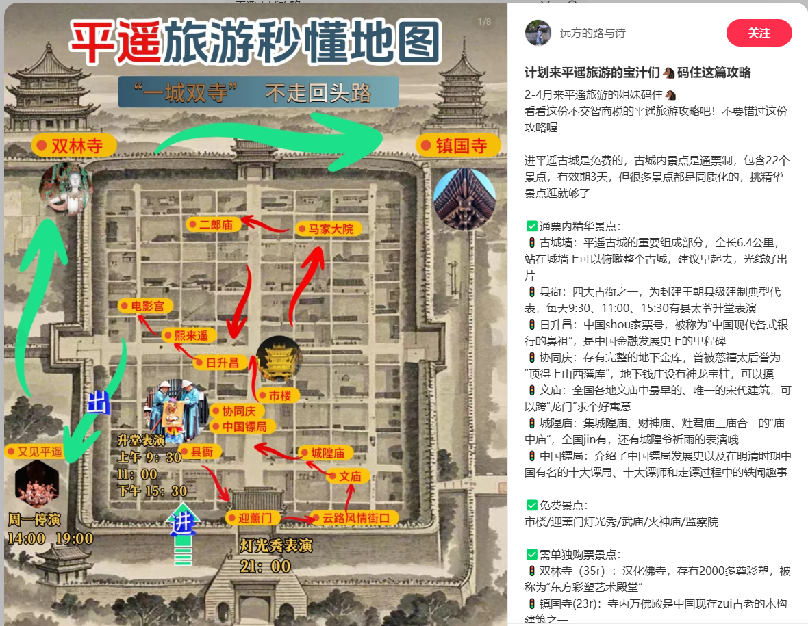

## 简介

主要有 王家大院(乔家大院不去)  平遥古城   双林寺  绵山

### 关于交通

北京出发，全程高铁+滴滴

##### 路线：

周五北京--太原，住一宿（太原南站附近）

早上 7点太原南---灵石东(灵石东比灵石到景点近很多)   晚上19.50 回平遥古城的车   

晚上17.42的车回北京

### 关于气温

三月末  10-20度

### 关于住宿

周五晚住太原。周六住平遥古城

### 关于博物馆

无

### 关于游玩

#### Day0

周五从北京出发，北京丰台站 20.02的车 发往太原南。晚上10点半下车，然后入住南站旁边的随意酒店民宿。

#### Day1

7点从太原南出发到灵石东，然后打车到王家大院 8点开园，大概游玩1个小时。然后打车到绵山。

大概九点多完事，然后去绵山。

##### 绵山

先坐车到终点站，**水涛沟**。 

- 然后往后走，走到**双龙戏珠**。然后返回。
- 返回水涛沟车到 **栖贤谷**。然后走到最顶上那个介公墓，坐电梯下来(15)。
- 然后再大巴车到 **正果寺** 电梯上去， **云峰寺** 这块就是 之字栈道（悬空栈道）正果寺里面有包骨真身佛像。
  - 路线 1：在正果寺坐电梯上山，逛完后走到云峰寺再下山，期间经过 “之” 字栈道，栈道虽然宽，但走起来很害怕（推荐） 
  - 路线 2：先去云峰寺，上去要爬很长很陡的楼梯！对老人不友好，然后再往 “之” 字栈道那边走，上山去正果寺，再坐电梯下山，省力
- 玩完大巴去**天桥**
  - 上面有蛇洞和悬空栈道
- 大罗宫
  - 中国道教建筑之首，号称小布达拉宫，依山而建，拍全景特壮观！这里有很多菩萨像，供奉着太上老君
  - 
- 然后坐车到门口 **龙头寺**

- 当天最后一站：平遥古城迎熏门（南门）外 看灯光秀。 是门外，不是城里。18分钟晚上21.00 -21.18

#### Day2 平遥古城（不用坐电瓶车）

关注下有固定时间节点的就行，又见平遥准备下午14点的场次。

升堂表演9.30  9点到那。灯光秀晚上21.00 可以前一天去看。其他景点没有时间限制。

- 早上8:00 开园。双林寺这个时间点开着 08:00-19:00
- 平遥古城迎熏门（南门）外 看灯光秀。 是门外，不是城里。18分钟晚上21.00 -21.18
- 早上取决于几点起来，如果起来的比较早的话就从迎薰门上城墙，然后直接风情街下城墙。去文庙-城隍庙-县衙这个路线。目前看就2公里不到的距离。1个半小时肯定能够。如果城隍庙完事还早呢，那就去协同庆和中国镖局，反正大概9点出头到县衙就行。
- 
- 从县衙逛完（表演大概10分钟左右），到镖局或者日升昌。反正是没逛过的地方。然后中午在天元奎 吃饭。然后吃完饭去又见平遥。 
- 又见平遥14：00-15：30  看完直奔 双林寺 双林寺逛完就打车回高铁站。

#### 吃饭的地方

- 天元奎 

- 山西特色铜火锅
