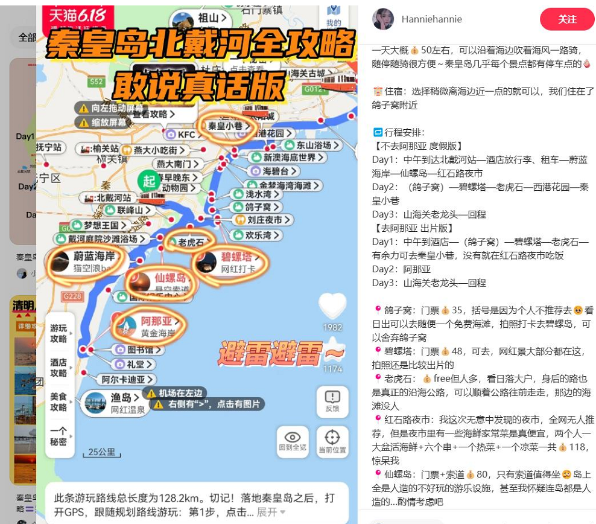
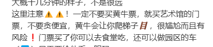
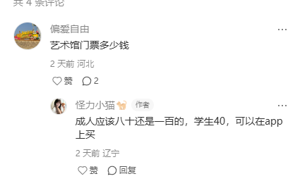

## 简介

主要是沿海周边玩。

### 关于交通

自驾

### 关于气温

5.10  春季 20度左右

### 关于住宿

### 关于博物馆

无

### 关于游玩

#### day1

北京出发---午饭（叶存利非遗海鲜大陷饺子）--山海关老龙头------碧螺塔 ----老虎石---西港花园----河东水产 买海鲜，找地方加工。

#### day2

早上---海天一色---仙螺岛---蔚蓝海岸--黄金海岸

