## 简介

预计走2日线，马武寨 ~ 韩口。精华景点：一线天；老龙口；无灯隧道；十字岭登顶；窟窿洞；

##### 轻装行程安排 

D1：马武寨—线天—抱犊村—老龙口—西莲—无灯隧道—赤焰峡—张沟（28公里，约9小时）  累计爬升：920m （中间有几公里是有车可以坐）

D2：张沟—十字岭—窟窿山—双峰—滴水寨—韩口（20公里，约8小时） 累计爬升：840m 

##### 补给点位(下撤点)

Day1: 马武寨  --- 7.5km---抱犊村 ----10.5km----西莲----7km----锡崖沟----2.5km----张沟

Day2: 张沟 ------滴水寨 ---- 韩口20km   第二天几乎无补给。

📍注意事项

1. 建议在抱犊补给后出发（抱犊到西连寺间隔路程长）
2. 西莲寺→后静宫这段水泥路可乘坐三轮车，10元/人；之后的后静宫→无灯隧道口之间有一段陡峭的爬升（约300m），有点抖，是第一天里面最难的一段
3. 无灯隧道口-张沟村这段公路可拼车，20元/人（我刷到别人是15一个人）；车开到锡崖沟景区处，为避免收费，需下车走一段山路绕过景区大门，再继续乘原车开往张沟村。
   1. 锡崖沟快到张沟的公路上有个卡口 要收费120，记得提前看两步路的路线轨迹，从公路左边的山上翻过去
4. 第二天行程没有补给，出发前准备好。
5. 张沟梯又陡又年久失修，有几处有塌了，尽量沿着崖壁内侧走，不要扶铁链⛓️和栏杆。如果要扶，扶前先看好坏，扶上再晃一下.
   1. 张沟去往十字岭上坡的栏杆年久失修
6. 张沟到十字岭山脚的这段爬升很痛苦，想保存体力的可以问问民宿老板能不能直接送到山脚。（送到垭口）
7. 到达窟窿山就可以摇司机过来接人了。（这个地方手机有信号）

下图中车代表这里有车可以坐；水是补给点

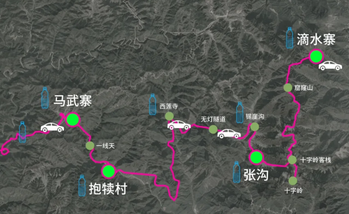

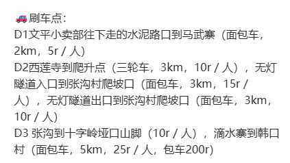

### 关于交通

从新乡拼车去马武寨，大概60~70元/人

### 关于气温

20+° 8月末得带外套。溯溪是在红豆杉大峡谷，本次不涉及，因此不用担心鞋涉水问题。

### 关于住宿

预计住《张沟》

### 关于博物馆

无

### 关于游玩

#### Day1

新乡大概7~8点出发1.5h左右到达马武寨。

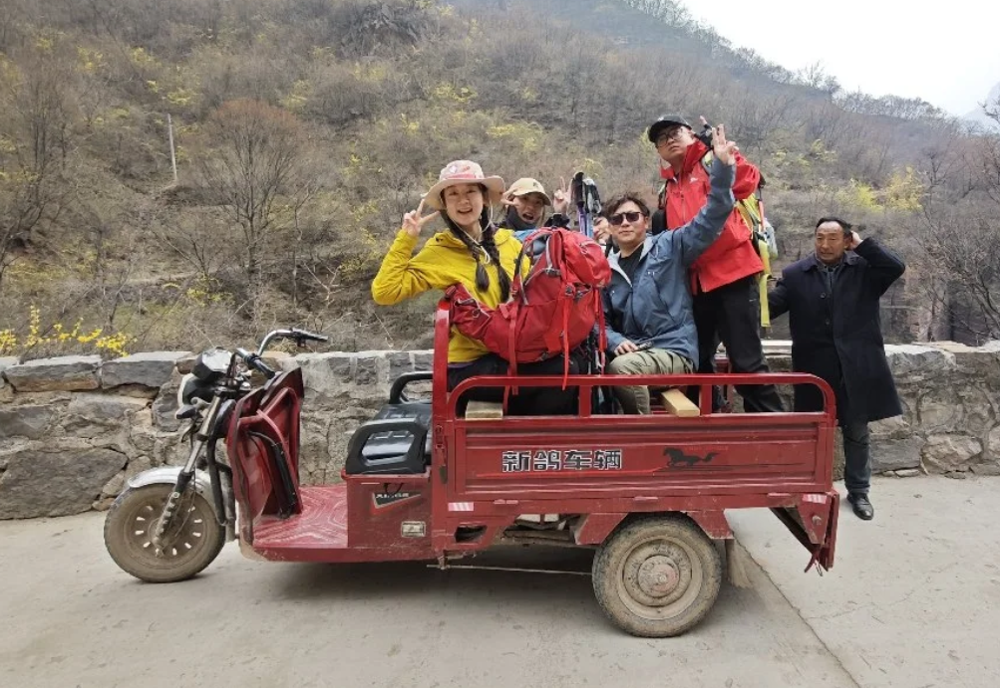

#### Day2

张沟出发 ~ 韩口。  十字岭可以登顶，看全景。登顶之后需要原路下撤，再往窟窿山那边走。

- 张沟上去登顶是个垭口（有铁皮房客栈上会写着十字岭客栈），往左是去王莽岭，往右去十字岭顶峰，去完十字岭原路回头再到此去王莽岭。

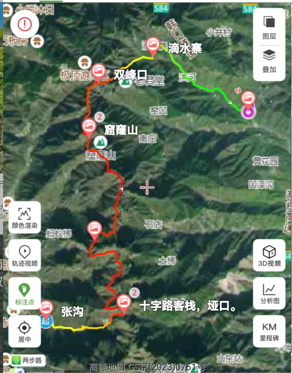

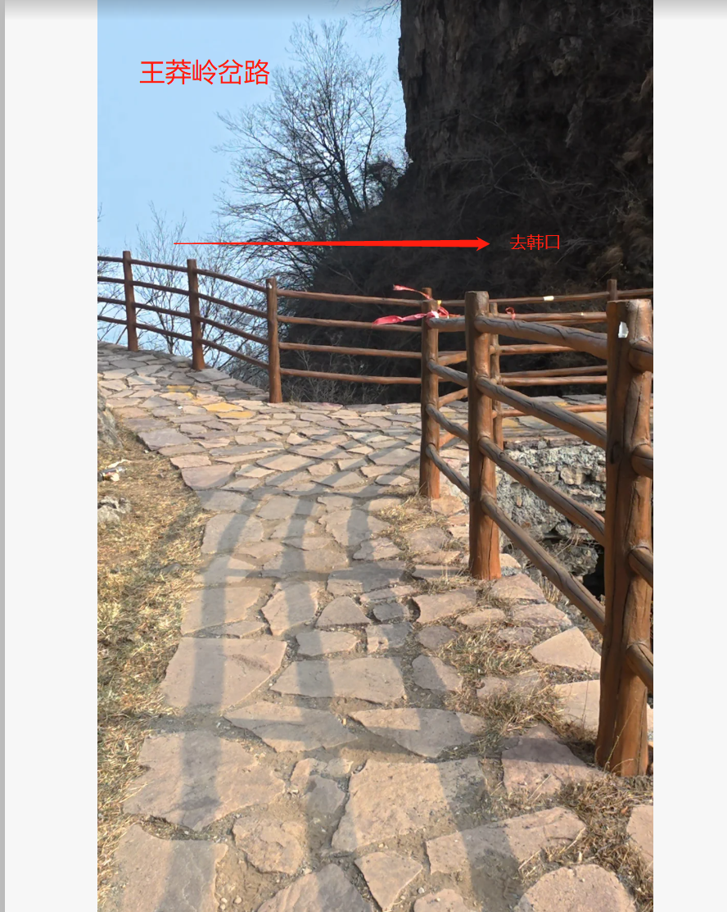

#### 拍照打卡点位

一线天（这里比较出片感觉）

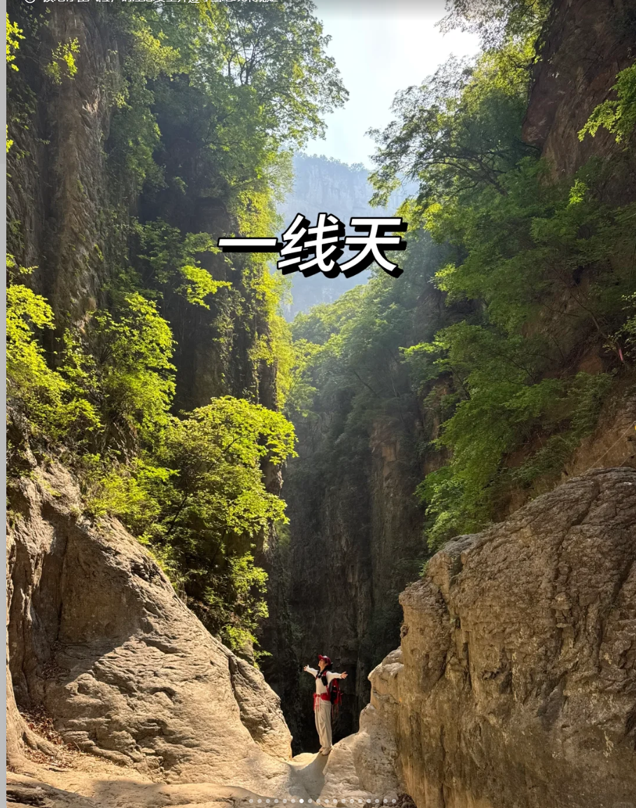

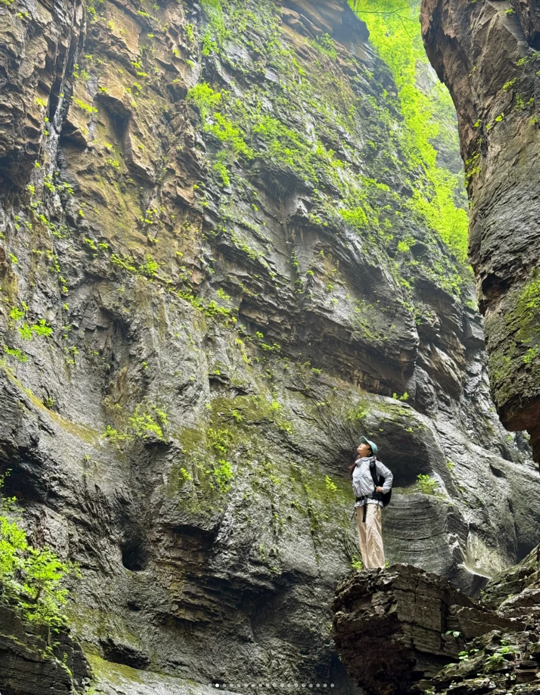

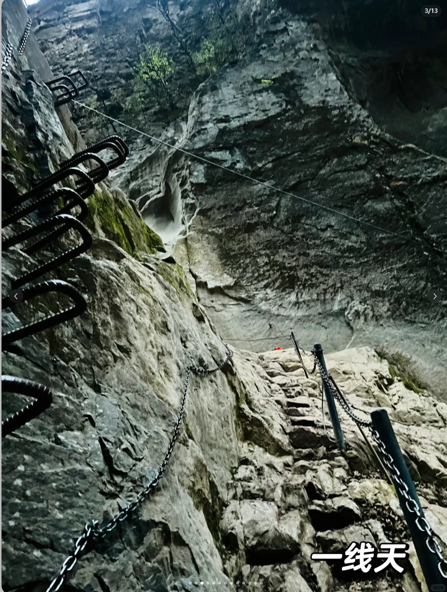

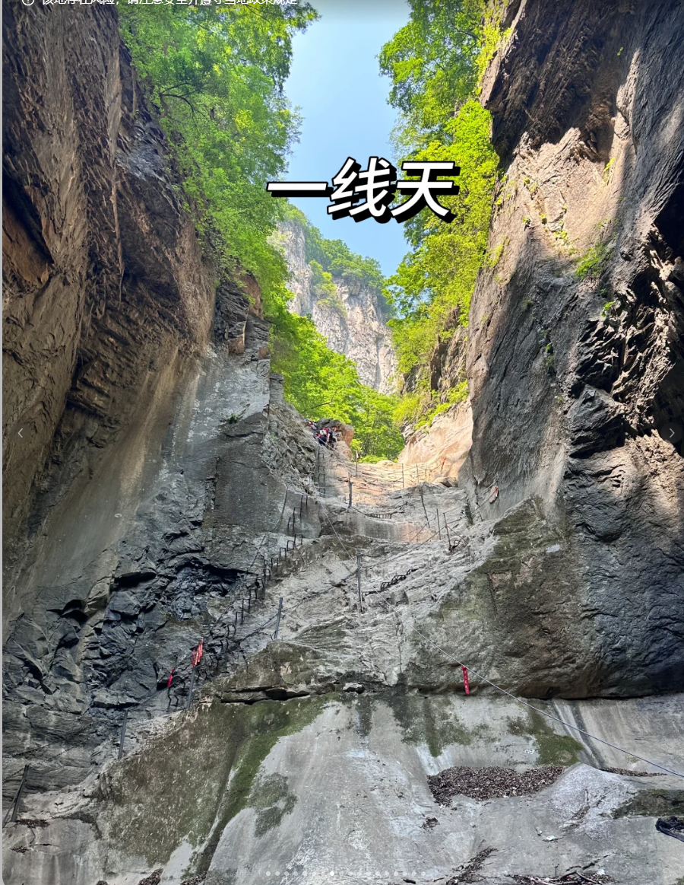

老龙口

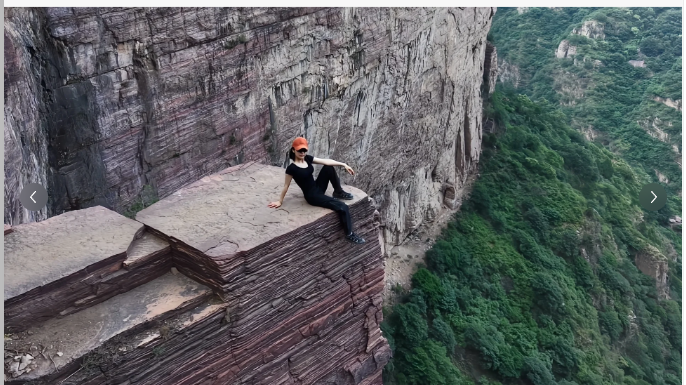

无灯隧道

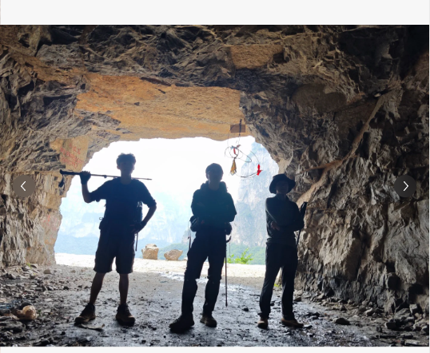

#### ------------------------下面为Day2--------------------------

十字岭

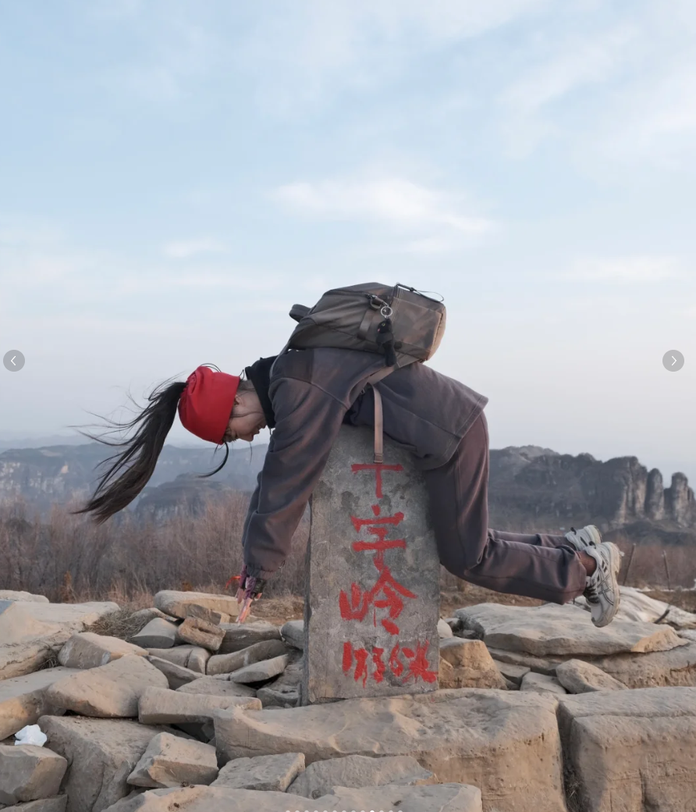

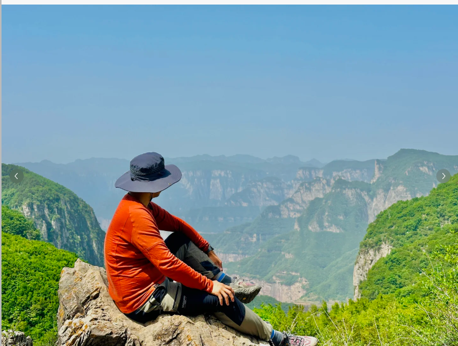

窟窿洞

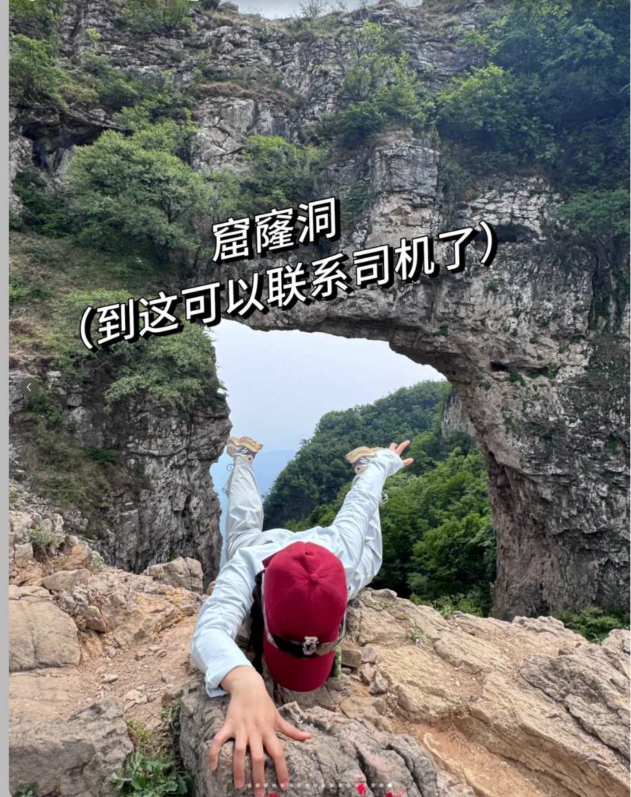

快到终点有个牌子（风情苑前500m左右）

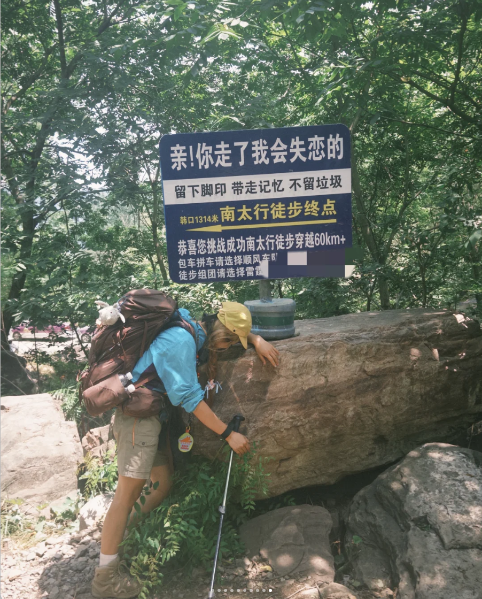