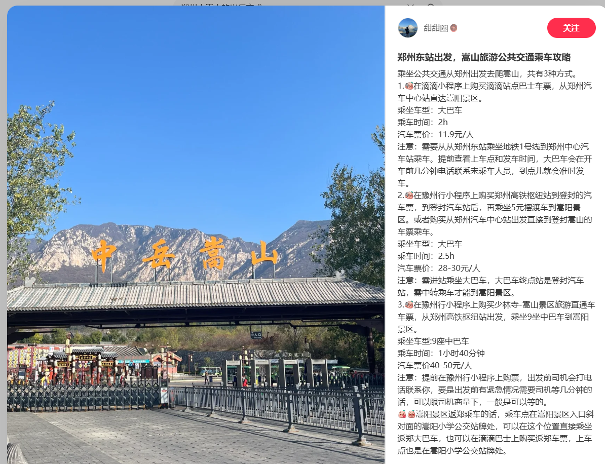
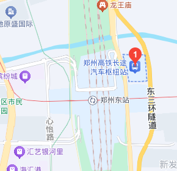
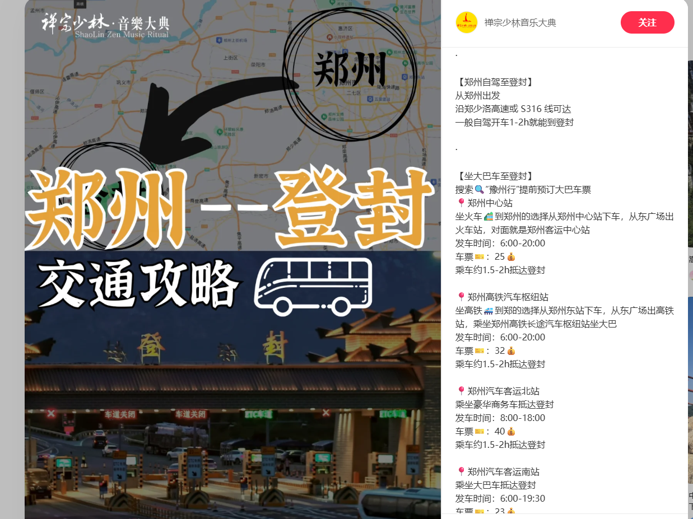
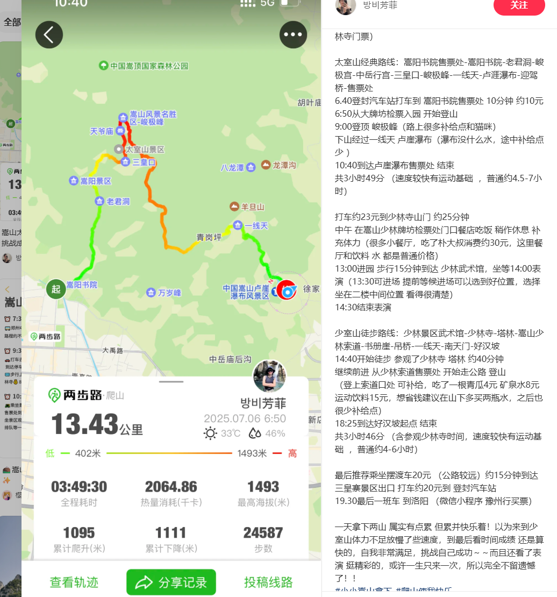
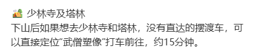
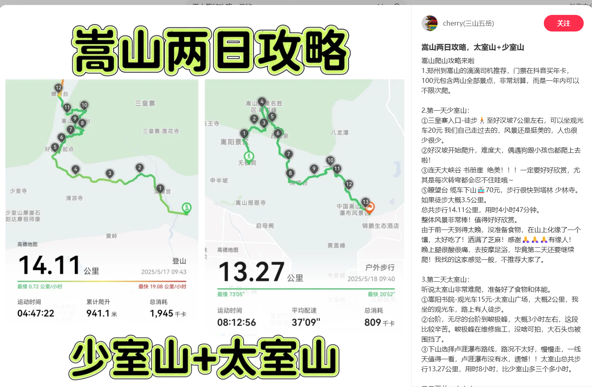

## 简介

去爬嵩山 + 少林寺 + 河南博物院。预计一日速穿 太室山+少室山。

### 关于交通

有地铁，但不在市区呆着。直接去登封 太室山和少室山，太 是中岳嵩山， 少是少林寺。

### 关于气温

### 关于住宿

周五住郑州东站周围，周六住登封。

### 关于博物馆

河南博物馆

### 关于游玩

周五晚上去郑州东站，然后第二天早上去登封，坐大巴去，可以在豫州行买票。 这个高铁枢纽站 有汽车直达登封

〔郑州东站〕下车，郑州高铁枢纽站——登封，33💰

提前网上买100元年卡 刷身份证即可进入 （含少林寺门票）

《一日速穿版本》 准备一日速穿少室山+太室山，要是当天有啥特殊情况就第二天走少室山。  当天在登封住。第二天回郑州，然后去河南博物馆打个卡。少林寺是4.30不让进。要提前到。

少林武术馆有表演。  一日速穿版就是反穿少室山。

武术馆表演时间:

上午：10：30-11：00      11：30-12：00 

下午：14：00-14：30      15：00-15：30

#### Day2

返回郑州，看看河南博物馆。然后撤。 
