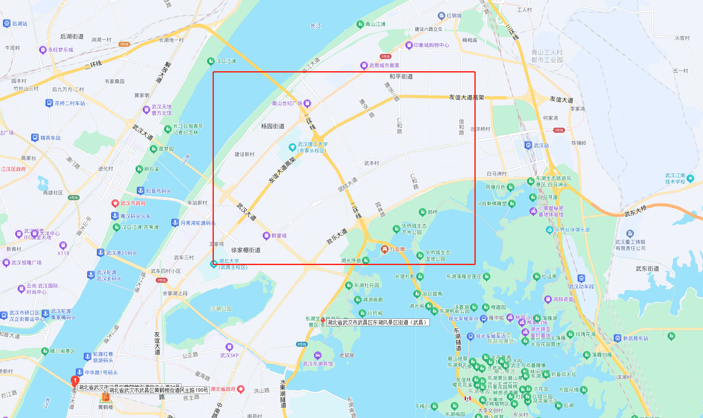
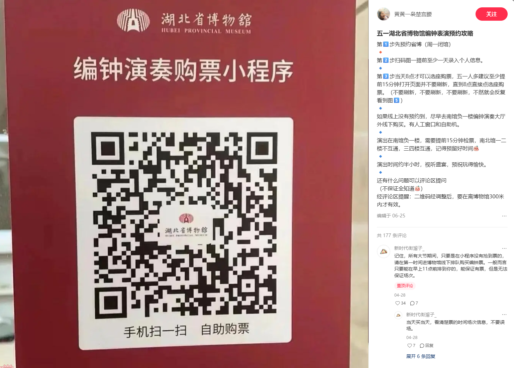
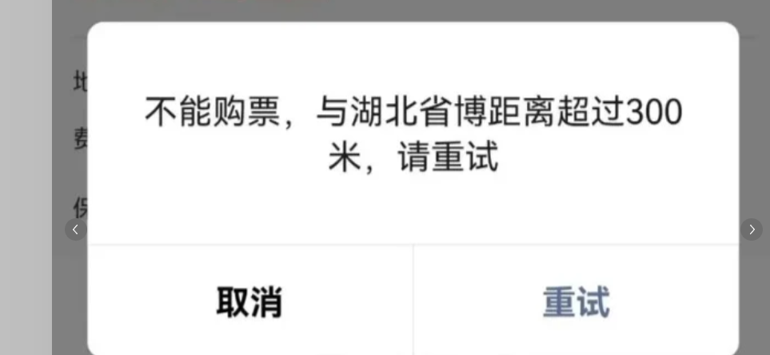
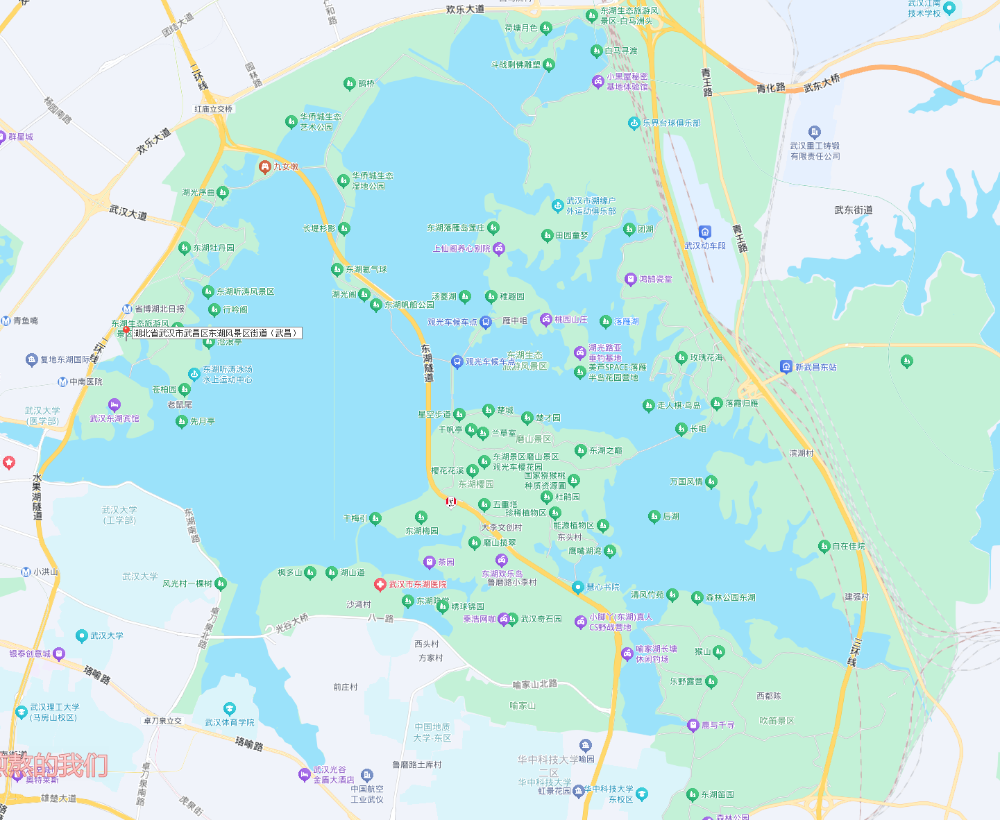
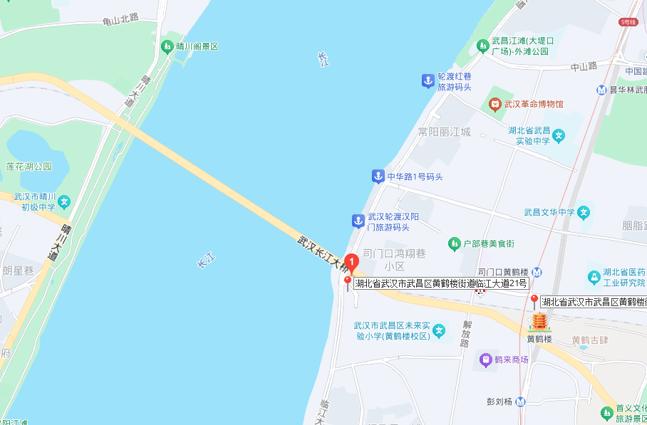
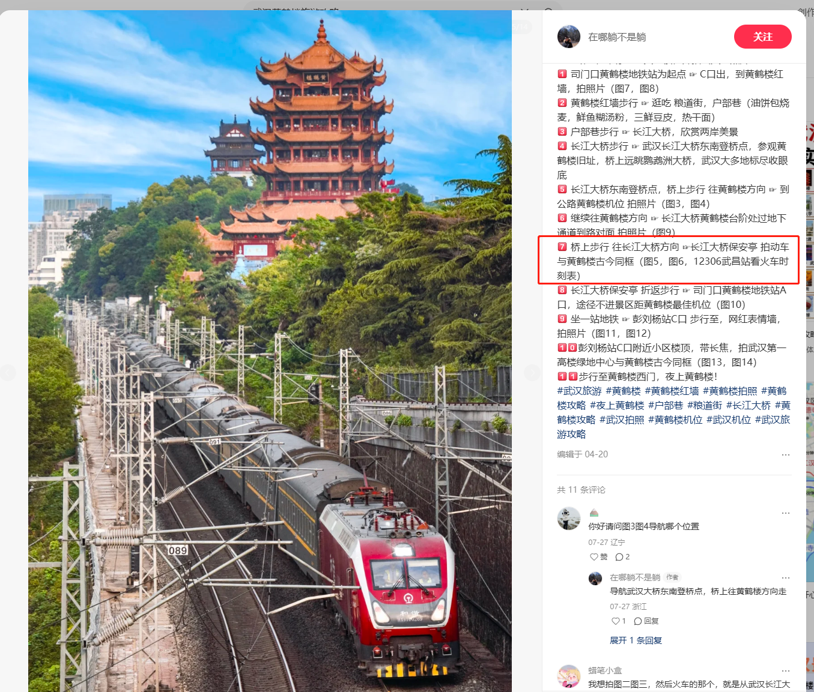
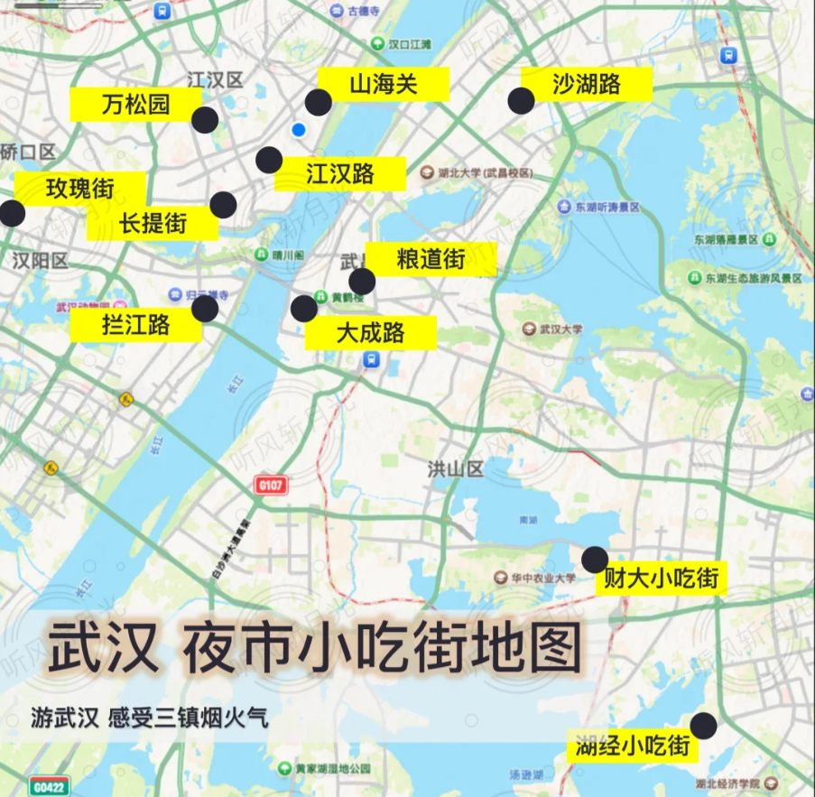
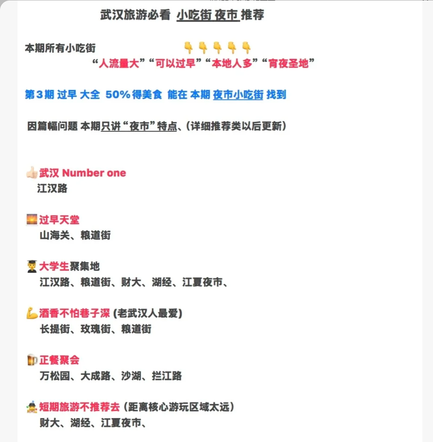
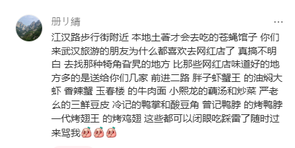

## 简介

### 关于交通

高铁过去，预计到武汉站，要去的地方都在市区，坐地铁 or 打车就行了。

### 关于气温

1. ‌**9月**‌：平均高温29°，平均低温20°。‌‌
2. ‌**10月**‌：平均高温23°，平均低温14°

穿个薄外套就行了。

### 关于住宿

住在省博附近。离武汉站近，下车放行李，第二天去下一站也近。

### 关于博物馆

湖北省博物馆。

### 关于吃

热干面，小龙虾，三鲜豆皮，藕汤，武昌鱼。

### 关于游玩

下车放完行李之后，直奔湖北省博。

1. 放票时间17.18，最多可提前5天预约。约基本陈列那个就行，其他三个带上基本陈列了，基本陈列没约上，约那个油画的。
2. 先去南馆看，南馆2楼有越王勾践剑(这个人格分裂的人)
3. 然后旁边2楼和1楼有曾侯乙编钟喝曾侯乙尊盘。
4. 3楼有虎座鸟架鼓

湖北省博南馆还有编钟表演，每天8点预约当天的。估计约不上，因为 有定位限制。

第二站：去东湖 骑车溜达溜达。溜达快到日落的点之后，去长江大桥，溜达蹲日落。看完日落拍完照之后，去黄鹤楼外面溜达溜达。东湖就不做攻略了，留着去探索吧。预计有2个小时时间，骑一圈稳稳够了。

第三站黄鹤楼

从武汉长江大桥东南登桥点往保安亭那个方向走。能拍到火车与楼同框，这个还挺有意思。

- 也可以去黄鹤楼可定位地铁c口，网上很火的黄鹤楼司门口地铁站。拍张外景看看就行了，里面没啥意思。随心所欲拍张照片瞅瞅就行了。

关于夜市：逛完之后晚上准备去夜市吃。准备去汉江路夜市。

